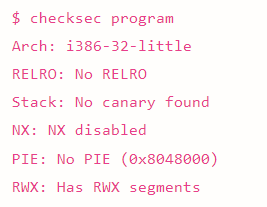
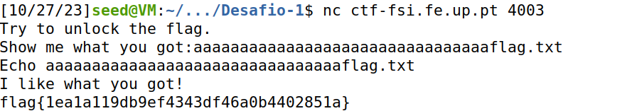
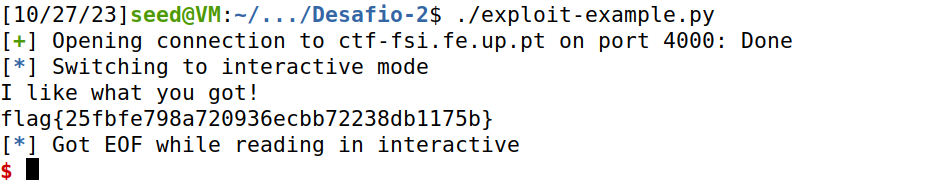

## **CTF 5**

###  Desafio 1 

Ao correr o comando "checksec program", conseguimos perceber que:
- a arquitetura do ficheiro é x86 (Arch)
- não existe um canário a proteger o return address (Stack)
- a stack tem permisssão de execução (NX)
- as posições do binário não estão randomizadas (PIE)
- existem regiões de memória com permissões de leitura, escrita e execução (RWX)

- Existe algum ficheiro que é aberto e lido pelo programa?
Sim, o mem.txt.

- Existe alguma forma de controlar o ficheiro que é aberto?
Sim, manipular o conteudo do buffer meme_file.

- Existe algum buffer-overflow? Se sim, o que é que podes fazer?
Sim, o buffer tem 32 bytes, sendo que através da função scanf são lidos 40 para o buffer.
Conseguindo manipular o conteudo lido para o buffer conseguimos fazer com que o ficheiro que contem a flag seja lido.

Através de user input com a string "aaaaaaaaaaaaaaaaaaaaaaaaaaaaaaaaflag.txt", conseguimos obter a flag.

###  Desafio 2 

Este desafio é semelhante ao anterior, sendo que existe mais um buffer val[] inicializado com \xef\xbe\xad\xde.

Ao executar o código percebemos que o buffer val[] chamado na função printf() aparecia deadbeef (ao contrário).

então correndo o script auxiliar de python, com a string "aaaaaaaaaaaaaaaaaaaaaaaaaaaaaaaa\x24\x23\xfc\xfeflag.txt", conseguimos satisfazer a condição deste desafio e obtendo assim a flag.

