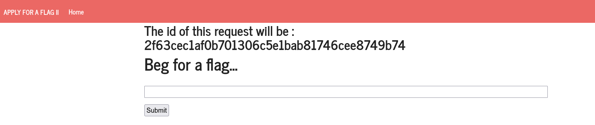
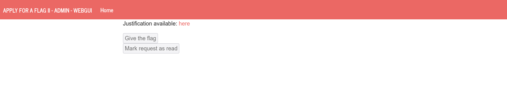
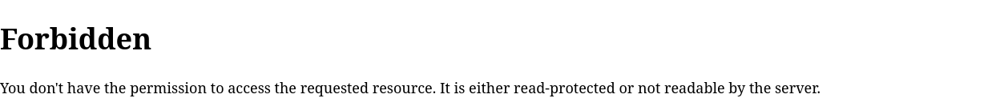
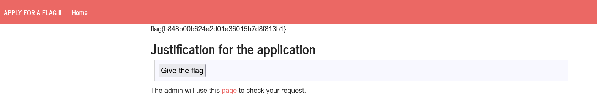

# CTF Semana #6 (XSS + CSRF)

> **Site:** http://ctf-fsi.fe.up.pt:5004/



When opening the site we are faced with a page with a form that can be submited to the server.

## Initial Analysis

As a start, we chose to submit the form with a random input such as "Hello World" and we checked that the following web page showed said input.

Following that, we decided to test to check if the website was prepared to prevent Cross-site Scripting (CSS), by passing it input in HTML. The result showed that there is no restriction to the input of the user, meaning that we can directly execute the code we input in the initial form.

So following that, we analyzed the page for the side of the administrator that would approve our request for the flag. 




As can be seen the buttons are disabled for the user, but the mehods to give the flag and mark as read the requests are defined.

```html
<form method="POST" action="/request/2f63cec1af0b701306c5e1bab81746cee8749b74/approve" role="form">
    <div class="submit">  
        <input type="submit" id="giveflag" value="Give the flag" disabled="">
    </div>
</form>
<form method="POST" action="/request/2f63cec1af0b701306c5e1bab81746cee8749b74/mark_as_read" role="formRead">
    <div class="submit">  
        <input type="submit" id="markAsRead" value="Mark request as read" disabled="">  
    </div>
</form>
```

In this code,  `2f63cec1af0b701306c5e1bab81746cee8749b74`  depends on the ID of our current request as defined in the main page.

## Exploit

So, after the previous information, we had the process through which we could obtain the flag.

By passing as the input of the initial form the method to approve the request `Give the flag`, it is only a matter of creating a small script that clicks the submit button in the form. when the page is loaded. In `request_id` our current ID should be passed.

```html
<form method="POST" action="http://ctf-fsi.fe.up.pt:5005/request/request_id/approve" role="form">
    <div class="submit">
        <input type="submit" id="giveflag" value="Give the flag">
    </div>
    <script>
        document.getElementById('giveflag').click();
    </script>
</form>
```

However, when doing that we are faced with:



This happened because when `http://ctf-fsi.fe.up.pt:5005/request/request_id` is being loaded the JavaScript we defined is run and the form redirects us to the administartor's server-side. However, this can be prevented either by backtracking or by disabling the JavaScript for the web page. 

So the submit button is clicked through the JavaScript, meaning that our request is approved through the form method and after this, simply by reloading the page we see our flag displayed in top of the page.


