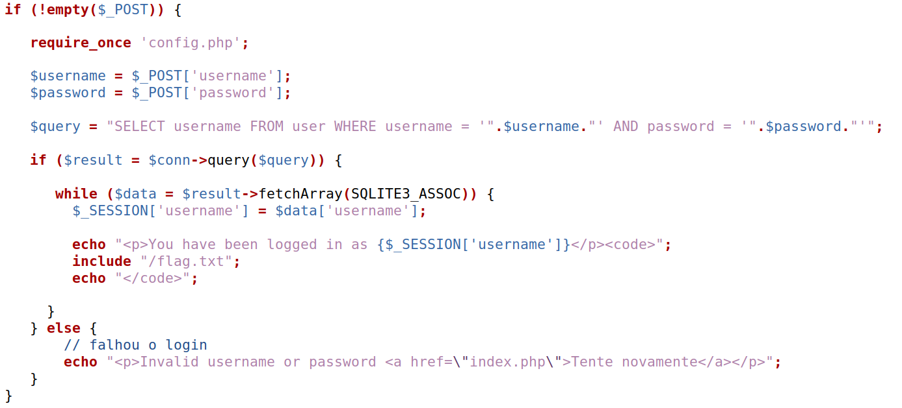
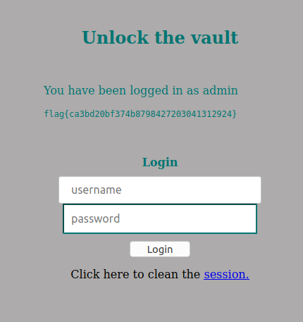

# CTF Semana #8 (SQL Injection)

> **Objetivo:** Explorar um SQL injection simples para saltar por cima de uma funcionalidade de autenticação.

## Análise

É fornecido um ficheiro PHP (`index.php`) com o código que  corre do lado do servidor cada vez que um utilizador se tenta autenticar no portal. A flag encontra-se num ficheiro `flag.txt` que é mostrado a utilizadores autenticados, de acordo com o enunciado do CTF. 

O primmeiro passo a seguir é analisar o código PHP e perceber como a query à base de dados é efetuada.



Como pode ser observado, o statement efetuado não tem qualquer `prepare` statement, o que implica que falha em separar código de dados, ou seja, não efetua a separação de que parte é o SQL da query e os dados que são introduzidos pelo utilizador e, desse modo, sujeitos a propósitos maliciosos.

### Questões do Moodle

- Que query SQL é executada para cada tentativa de login?

  A query de SQL efetuada a cada tentativa de login é `SELECT username FROM user WHERE username = '".$username." ' AND password ='".$password."'`. Esta query recebe como parâmetros diretamente do utilizador através do PHP, `$username` e `$password`.

- Que input podes manipular para usurpar a query? Que caracteres especiais utilizaste e porquê?

  O input que pode ser manipulado são as variáveis `$username` e `$password` que são recebidas a partir de um pedido POST tendo em conta que não existe qualquer validação do SQL nem do input do utilizador. 

  Assim, considerando o statement, ao passar com input `'; --`, conseguimos autenticarmos-nos no serviço. 

  ​	`'` antecipa o final da query removendo a necessidade de comparar a palavra passe desse username com a palavra-passe introduzida por nós. 

  ​	`; ` marca o final do SQL statement e ainda que fosse opcional neste caso ocorrem situações diferentes em que é necessário para outras versões 	do SQL. 

  ​	Por fim, `--` torna o resto da query num comentário, prevenindo assim o erro: 

  ```sql
  **Warning**:  SQLite3::query(): Unable to prepare statement: 1, near "' AND   password = '": syntax error in 	**/var/www/html/index.php** on line **42**sql
  ```

  Dessa forma, a query submetida será sempre bem sucedida a encontrar um username igual ao pretendido.

- Qual query SQL é efetivamente executada com a tua tentativa de login maliciosa? Porque é que essa query te permite fazer login?

  A query efetuada na realidade é `SELECT username FROM user WHERE username = 'admin'; -- AND password ='pass'` em que password pode ser aquilo que quisermos. Desde que o utilizador que escolhamos exista, conseguimos sempre  autenticação pelos motivos descritos acima.

## Ataque

Assim, pode-se usar uma tática semelhante à usada nos SEED Labs. Começamos por utilizar os métodos mais habituais e `admin';#` permitiu logo efetuar o login na plataforma `http://ctf-fsi.fe.up.pt:5003`.

A presença de `'; --` permitiu antecipar o final da query, deixando de efetuar a comparação da password uma vez que essa está comentada.


