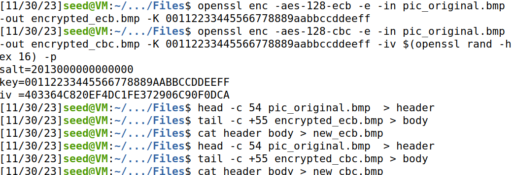

# Lab from week #10 - Crypto_Encryption

## Task 1

This task has as its goals to understand how to create and decrypt a mono-alphabetic substitution cipher. This cipher is not considered secure since it can be subjected to frequency analysis. In the Lab, we are provided with a ciphered text in the file `ciphertext.txt`. 

For its creation, the following steps were followed:

1.  **Generate the encryption key**

    ```sh
    #!/bin/env python3
    import random
    s = "abcdefghijklmnopqrstuvwxyz"
    list = random.sample(s, len(s))
    key = ’’.join(list)
    print(key)
    ```

2. **Simplification of the original article**

    ```shell
    tr [:upper:] [:lower:] < article.txt > lowercase.txt
    tr -cd ’[a-z][\n][:space:]’ < lowercase.txt > plaintext.txt
    ```

​	In real encryption using mono-alphabetic cipher,spaces will be removed.  We keep the spaces to simplify the task.

3. **Use the `tr` command to do the encryption**

    ```shell
    tr ’abcdefghijklmnopqrstuvwxyz’ ’sxtrwinqbedpvgkfmalhyuojzc’ \< plaintext.txt > ciphertext.txt
    ```

The `freq.py` script provided reads the `ciphertext.txt` file, and produces the statistics for n-grams, including the single-letter frequencies, bigram frequencies (2-letter sequence), and trigram frequencies (3-letter sequence).

Considering [Frequency Analysis](https://en.wikipedia.org/wiki/Frequency_analysis), [Bigram frequency](https://en.wikipedia.org/wiki/Bigram) and [Bigram frequency](https://en.wikipedia.org/wiki/Trigram), we can analyze the result of the frequency analysis for our encripted file and  transform a few letters. For example, considering that E, T and A are the 3 most common letters in the English language it is only a matter of replacing the letters with: `tr 'nyv' 'ETA' < ciphertext.txt > out.txt`

We conclude that the final decrypted text can be obtained by running:

```shell
tr 'nyvtlmxbfpuhzqdrisegacokj' 'ETAHWIOFVDNRUSYGLKPBCMJXQ' < ciphertext.txt > out.txt
```

## Task 2

The goal of this task is to experiment with different algorithms and modes using the `openssl enc` command. The ciphers tested are: `aes-128-cbc`, `bf-cbc`, and `aes-128-cfb`. 

> `openssl` - The openssl program is a command line tool for using the various cryptography functions of OpenSSL's crypto library from the shell.  It can be used for:
>
> * Creation and management of private keys, public keys and parameters
> * Public key cryptographic operations
> * Encryption and Decryption with Ciphers
> * SSL/TLS Client and Server Tests
> * Time Stamp requests, generation and verification

> `enc` - The symmetric cipher commands allow data to be encrypted or decrypted using various block and stream ciphers using keys based on passwords or explicitly provided.
>
> ```shell
> openssl enc [cipher] [OPTIONS]
> ```
>
> In each command:
>
> - `-aes-128-cbc`, `-bf-cbc`, and `-aes-128-cfb` specify the cipher type.
>
> - `-e` Encrypt the input data: this is the default.
>
> - `-d` Decrypt the input data: this is the default.
>
> - `-in filename` The input filename, standard input by default.
>
> - `-out filename.bin` specifies the output file.
>
> - `-K` 
>
>   The actual key to use: this must be represented as a string comprised only of hex digits. If only the key is specified, the IV must additionally specified using the -iv option. When both a key and a password are specified, the key given with the -K option will be used and the IV generated from the password will be taken. It does not make much sense to specify both key and password.
>
> - `-iv` specifies the initialization vector in hex.
>
>   The actual IV to use: this must be represented as a string comprised only of hex digits. When only the key is specified using the -K option, the IV must explicitly be defined. When a password is being specified using one of the other options, the IV is generated from this password.


***

1. **`aes-128-cbc`**

**AES-128-CBC** is a specific encryption algorithm and mode that falls under the Advanced Encryption Standard (AES). 

The number "128" in AES-128-CBC refers to the key size. In AES, the key  length can be 128, 192, or 256 bits. AES-128 uses a 128-bit key. 

AES-128-CBC employs  the **CBC (Cipher Block Chaining)** mode of operation.  In CBC mode, each block of plain text is the result of an exclusive OR operation with the previous cipher text block before being encrypted.

It is a symmetric encryption algorithm,  meaning the same key is used for both encryption and decryption. CBC  mode provides additional security by introducing dependencies between  blocks of data, preventing certain types of attacks. 

The key is created using the `-K` option, followed by a  32-character hexadecimal string. The hexadecimal string represents the  key in a format that is 16 bytes long. Therefore, the key is 16 bytes long, or 128 bits, which is suitable for the specified AES-128 encryption.

The initialization vector is a random or pseudo-random value that, when  combined with the encryption key, **ensures that the same plain text will  encrypt to different cipher texts each time it is encrypted**. In practice, it's common to use a random IV for each encryption operation. This randomness helps ensure that even if the same plain text is encrypted multiple times with the same key, the resulting cipher texts will differ. We can generate a random IV using a command like:

   ```
   openssl rand -hex 16
   ```

   Commands run:

   ```shell
   openssl enc -aes-128-cbc -e -in out.txt -out cipher_aes-128-cbc.bin -K 00112233445566778889aabbccddeeff -iv $(openssl rand -hex 16) -p
   # Encrypt using aes-128-cbc
   hexdump -C cipher_aes-128-cbc.bin
   # To view the content of an encrypted file without decrypting it, we used hexdump since it allows to see the resulting binary file.
   openssl enc -aes-128-cbc -d -in cipher_aes-128-cbc.bin -out decrypted_aes-128-cbc.txt     -K 00112233445566778889aabbccddeeff -iv CC4DAF0EEFB3957BD9C11A6B5B264F2E
   # Decrypt aes-128-cbc
   ```


***

2. `bf-cbc`** - Blowfish algorithm in Cipher Block Chaining (CBC) mode

**Blowfish Algorithm:** Blowfish is a symmetric-key block  cipher. It operates on fixed-size blocks of data (64 bits) and supports key lengths from 32 bits to 448 bits.

  ```shell
  openssl enc -bf-cbc -e -in out.txt -out cipher_bf-cbc.bin -K 00112233445566778889aabbccddeeff -iv $(openssl rand -hex 8) -p
  # Since the blocks are of 64 bits, our initialization vector should only have 8 bytes.
  openssl enc -bf-cbc -d -in cipher_bf-cbc.bin -out decrypted_bf-cbc.txt -K 00112233445566778889aabbccddeeff -iv B6E349BB5E3B617C
  ```


****

3. **`aes-128-cfb`** - AES (Advanced Encryption Standard) algorithm in Cipher Feedback (CFB) mode with a key size of 128 bits

**CFB (Cipher Feedback) Mode:** CFB is a mode of operation  for block ciphers, including AES. In CFB mode, the encryption of each  block of plaintext depends on the previous ciphertext block. It turns a  block cipher into a stream cipher, allowing for the encryption of  individual bits or bytes.

```shell
openssl enc -aes-128-cfb -e -in out.txt -out cipher_aes-128-cfb.bin -K 00112233445566778889aabbccddeeff -iv $(openssl rand -hex 16) -p
openssl enc -aes-128-cfb -d -in cipher_aes-128-cfb.bin -out decrypted_aes-128-cfb.txt     -K 00112233445566778889aabbccddeeff -iv D1ABD50FEB8948FB12FCBF9DE286BB8C
```


## Task 3

The objective is to encrypt `pic_original.bmp` so people without the encryption keys cannot know what is in the picture using the ECB (Electronic Code Book) and CBC (Cipher Block Chaining) modes.

> Electronic Code Book is a mode of operation for block ciphers,  including symmetric key encryption algorithms like AES (Advanced  Encryption Standard). In ECB mode, each block of plain text is  independently encrypted with the same key. The key is applied directly  to each block of data, and there is no dependence on previous or  subsequent blocks during the encryption process.
>
> Each block is independently encrypted using the same encryption key. The same key is applied to each block in the same manner. There is no dependency between blocks during encryption. Each block is treated in isolation and the resulting cipher text blocks are concatenated to form the final encrypted message.

```shell
openssl enc -aes-128-ecb -e -in pic_original.bmp -out encrypted_ecb.bmp -K 00112233445566778889aabbccddeeff
openssl enc -aes-128-cbc -e -in pic_original.bmp -out encrypted_cbc.bmp -K 00112233445566778889aabbccddeeff -iv $(openssl rand -hex 16) -p
# salt=2013000000000000
# key=00112233445566778889AABBCCDDEEFF
# iv =359B132174109BFB58B0A562A82A26AF

```

For the `.bmp` file, the first 54 bytes contain the header information about the picture. We have to set it correctly, so the encrypted file can be treated as a legitimate `.bmp` file. We can use the `bless` hex editor tool (already installed on our VM) to directly modify binary files. Or alternatively, for our case:

```shell
head -c 54 pic_original.bmp  > header # Extract the header from the original picture
tail -c +55 encrypted_ecb.bmp > body # Extract the data from the encrypted files (from offset 55 to the end)
cat header body > new_ecb.bmp # Combine the header and data to create new .bmp files
```




As can be seen, the files can be treated as images and opened with image viewers. For the ECB mode certain information can be gleaned from the encrypted file such as shapes, whereas for the CBC nothing can be gleaned. This happens due to the mode used for the AES algorithm.

In **Electronic Code Book** mode, each block is independently encrypted with the same key. This means that **identical blocks** of plain text will **result** in **identical blocks** of cipher text. As a result, *patterns and repetitions* in the plain text will be *visible* in the cipher text.

On the other hand, **Cipher Block Chaining** mode introduces a level  of diffusion and randomness into the encryption process. Each block of  plain text is the result of an exclusive or operation with the previous cipher text block before encryption. This chaining of blocks breaks patterns and makes it more resistant to certain types of attacks.
