# LabEnvironment

adicionar novas entradas nos hosts da maquina virtual e executar os containers
```bash
10.9.0.80 www.bank32.com
```
```bash
dcbuild
dcup  
```

# Task1
copiar o ficheiro de configuração e retirar o comentário para ```uniquesubject = no``` para permitir a criação de certificados com o mesmo "subject" e dar o setup ao CA.
```bash
cp /usr/lib/ssl/openssl.cnf ./openssl.cnf
nano ./openssl.cnf
```
```bash
mkdir myCA && cd ./myCA
mkdir certs crl newcerts
touch index.txt
echo "1000" >> serial
```

gerar o certificado para o CA

```bash
openssl req -x509 -newkey rsa:4096 -sha256 -days 3650 \ -keyout ca.key -out ca.crt
```

depois de preencher os campos de informação (com password, nome do país, etc) é criado em ```ca.key``` o certificado da chave publica e em ```ca.crt``` a chave privada da CA

para ver o conteúdo
```openssl x509 -in ca.crt -text -noout```


- É um certificado CA porque existe na secção basic constraints o atributo certificate authority verdadeiro (CA:True).

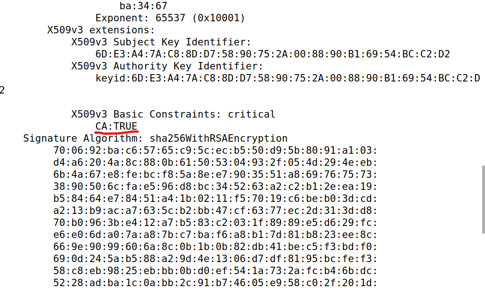

- O certificado é self-signed porque o campo issuer e o subject são iguais.

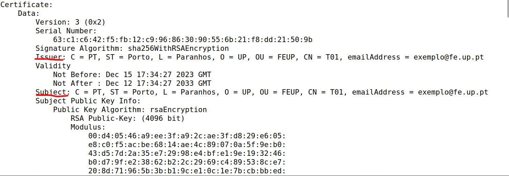

```openssl rsa -in ca.key -text -noout```

Conseguimos ver o conteúdo do ficheiro gerado. Conseguimos identificar os campos de:
- modulus (n)
- publicExponent (e)
- privateExponent (d)
- prime1 (p)
- prime2 (q)
- exponent1
- exponent2
- coefficient

# Task2

Para gerar para o site www.bank32.com a public/private key e criar o certificate signing request para a chave publica executamos o comando:

```bash
openssl req -newkey rsa:2048 -sha256 -keyout server.key -out server.csr -passout pass:1234 -subj "/CN=www.bank32.com/O=Bank32 Inc./C=US" -addext "subjectAltName=DNS:www.bank32.com,DNS:www.bank32A.com,DNS:www.bank32A.com"
```

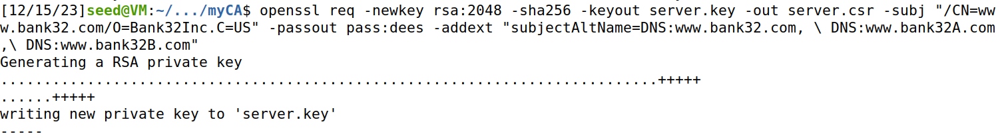

Assim foram criados dois ficheiros server.csr (chave privada) e server.key (chave pública). 

Podemos ver o seu conteúdo com os comandos

```bash
openssl req -in server.csr -text -noout
openssl rsa -in server.key -text -noout
```


# Task3

O objetivo agora é gerar o certificado para a servidor que fez a request na task anterior. Depois de comentarmos no ficheiro ```openssl``` como diz no guião para ```copy_extensions=copy```, executando o seguinte comando:


```
openssl ca -config openssl.cnf -policy policy_anything \-md sha256 -days 3650 \-in server.csr -out server.crt -batch \-cert ca.crt -keyfile ca.key
```

É gerado o certificado para o servidor como mostra a imagem.

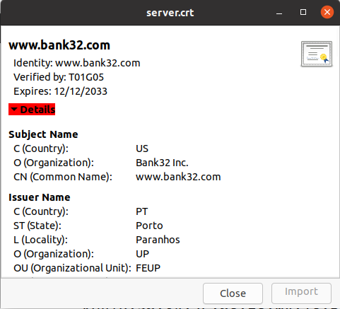


Ainda executando ```openssl x509 -in server.crt -text -noout``` conseguimos ver que o certificado abrange todos os nomes referidos em cima

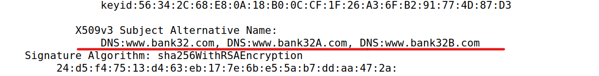

# Task4


Copiamos os ficheiros "server.ctf" e "server.key" para a pasta partilhada ```/volumes``` como diz no enunciado e alteramos os nomes para bank32. Modificamos o ficheiro "etc/apache2/sites-available/bank32_apache_ssl.conf" dentro do container, para que o certificado e chave usados sejam os da pasta partilhada ```/volumes```.


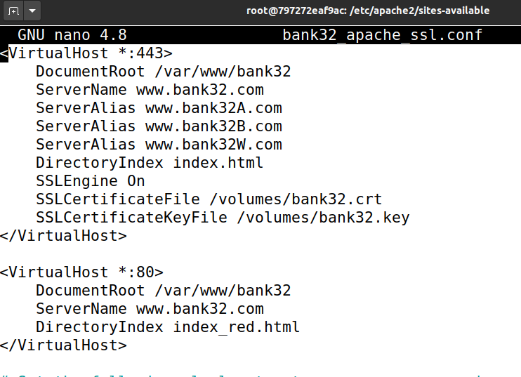


Depois de já termos tudo configurado podemos executar o comando ```service apache2 start``` dentro do terminal do container.

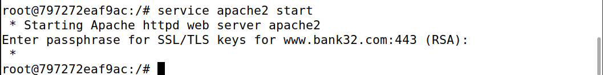


Acedendo ao site ```http://www.bank32.com/``` observamos que a ligação não é segura, (não estava encriptada).

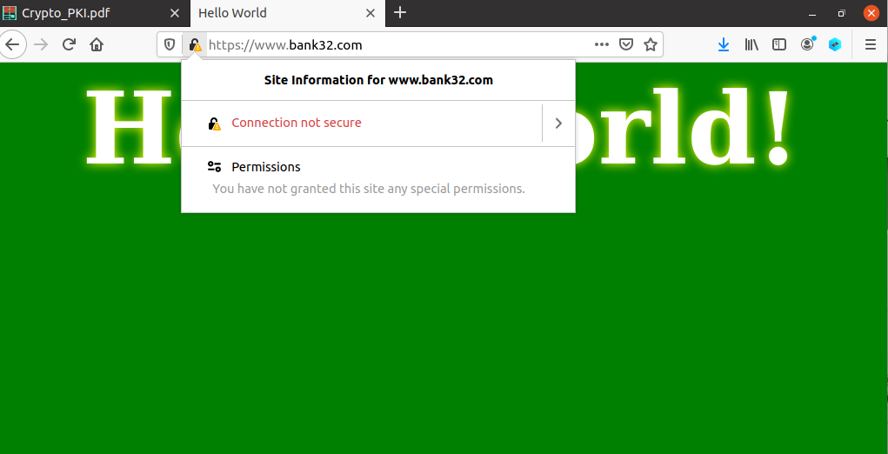


Para tornar a ligação segura temos de adicionamos o certificado CA que geramos às autoridades no browser.
Para isso, tal como o guião indica, pesquisámos no firefox ```about:preferences#privacy```, depois de alguma exploração conseguimos adicionar o certificado na aba de ```certificados```.


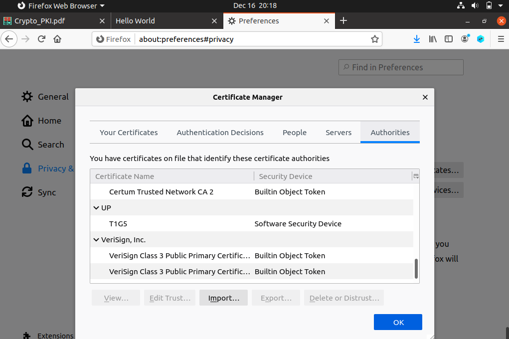


O que tornou a ligação segura.


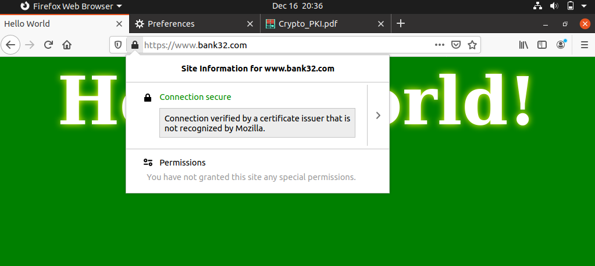


# Task5

A configuração do servidor ```"etc/apache2/sites-available/bank32_apache_ssl.conf"``` foi agora modificada para o campo ServerName o site ser ```www.example.com``` em vez de ````www.bank32.com```, com as configurações anteriores.


Adicionamos ainda a entrada do DNS da vítima ```10.9.0.80 www.example.com``` em etc/hosts, o que liga o hostname ao IP do webserver malicioso.


Fazemos restart ao servidor com o comando ```sudo service apache2 reload```.


Ao visitar o site www.example.com verificamos que o browser alerta para um potencial risco de segurança.

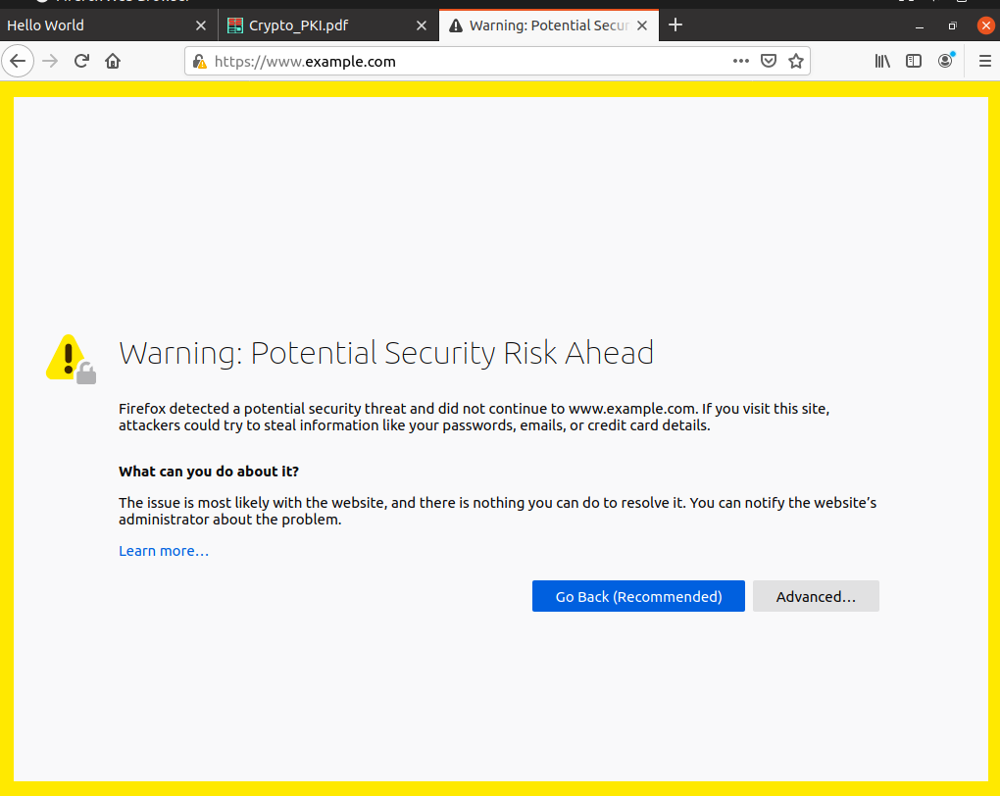


Avançando para o site.


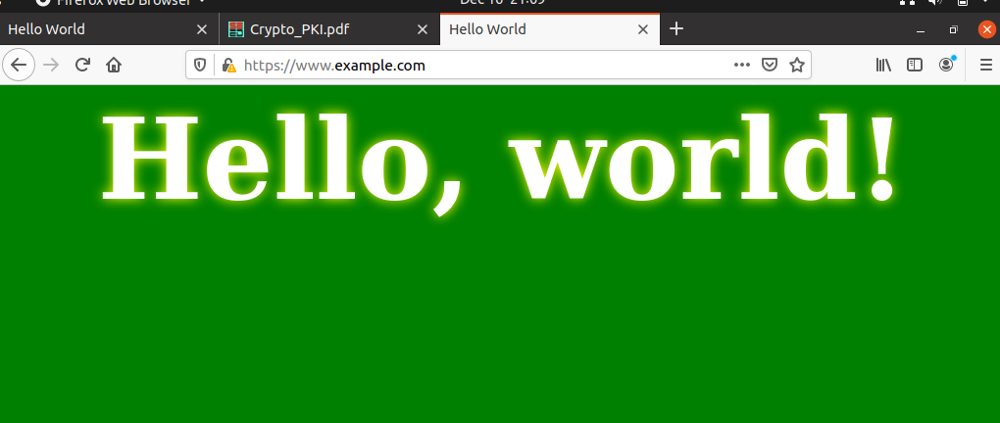


Este acontecimento deve se ao facto do nome de dominio não coincidir com aquele presente no certificado do servidor.


# Task6


Admitimos agora que o nosso CA está comprometido, então para entrar num possivel site malicioso ```www.example.com``` temos de gerar o certificado para este site.

```
openssl req -newkey rsa:2048 -sha256 -keyout example.key -out example.csr -subj "/CN=www.example.com/O=example Inc./C=US" -passout pass:1234

openssl ca -config openssl.cnf -policy policy_anything -md sha256 -days 3650 -in example.csr -out example.crt -batch -cert ca.crt -keyfile ca.key
```


De seguida modificamos o ficheiro de configuração do servidor ```bank32_apache_ssl.conf``` para utilizar os dois ficheiros que geramos relativos ao certificado e chave, example.csr e example.key:


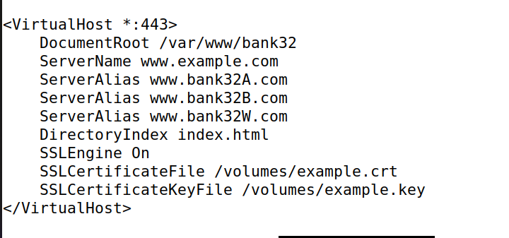


Ao dar reiniciar o servidor e visitar ```www.example.com``` verificamos que a ligação é agora segura.


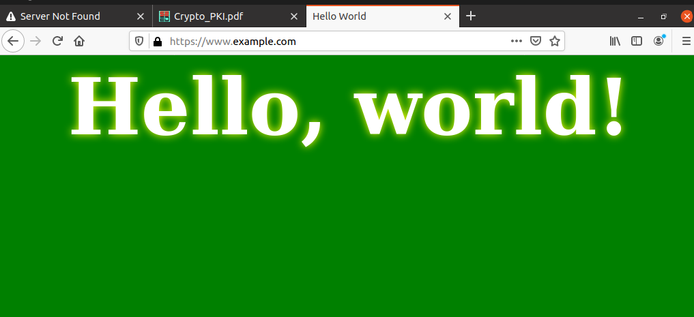

