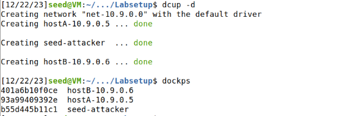

# LOGBOOK da Semana #13 - Sniffing and Spoofing

## Setup

Transferiu-se `category-network/Sniffing_Spoofing/Labsetup` e correu-se o container Docker com os seguintes comandos.



Adicionalmente, é possivel verificar o setup da rede local partilhada entre os diferentes containers (rede 10.9.0.1) usando `ifconfig`.


Therefore, the network id we will use in our programs will be br-9aec65a02a20


Changed to 

```
a9f16096efca  hostB-10.9.0.6
def7102094bd  seed-attacker
85a66f0086e4  hostA-10.9.0.5

br-cb19ce13ec26

NETWORK ID          NAME                DRIVER              SCOPE
4305c33574f7        bridge              bridge              local
b3581338a28d        host                host                local
cb19ce13ec26        net-10.9.0.0        bridge              local
77acecccbe26        none                null                local

or 

a9f16096efca  hostB-10.9.0.6
def7102094bd  seed-attacker
85a66f0086e4  hostA-10.9.0.5

br-cb19ce13ec26

NETWORK ID          NAME                DRIVER              SCOPE
4305c33574f7        bridge              bridge              local
b3581338a28d        host                host                local
cb19ce13ec26        net-10.9.0.0        bridge              local
77acecccbe26        none                null                local
```

## Task 1

Esta task tem como objetivo compreender o uso da ferramenta Scapy para sniffing de pacotes e a sua utilidade na construção de outras ferramentas mais direcionadas. Para esta task, é necessário começar por escrever um script em pyhton.

```python
# view mycode.py
#!/usr/bin/env python3

from scapy.all import *

a = IP()
a.show()
```

Correndo esse script com permissões de root na VM do seed-atacker é possivel obter as seguintes informações da rede.


O metodo `IP()` cria e retorna um pacote no IP default da nossa rede. e o comando `show()`mostra o conteúdo do pacote.

***

### Task 1.1

#### 1.1A

```python
#!/usr/bin/python3

from scapy.all import *

def print_pkt(pkt): 
    pkt.show()


interfaces = ['br-cb19ce13ec26','enp1s0','lo']
pkt = sniff(iface=interfaces, prn=print_pkt)
```

Este código permite que, por cada pacote capturado, a função print_pkt será invocada e imprimir alguma informação sobre os pacotes na rede. 

As interfaces na qual se está a fazer sniffing foram obtidas correndo o comando `ifconfig` que nos mostra as portas configuradas e ativas no nosso dispositivo. Depois, criei um array com as interfaces às quais pretendo escutar.

Correndo sem permissões de root, tem-se que:


Alternativamente a correr o programa com sudo é possivel efetuar o mesmo com o comando `chmod a+x sniffer.py`.


#### 1.1B

This task can be accomplished by modifying the the filters we have in our `sniffer.py`. Os filtros aceitam a sintaxe de Berkeley Packet Filter, pelo que se tornou necessario pesquisar qual o formato do filtro que é mais adequado a cada situação.

Nota: Como seed-attacker partilha a pasta volumes com a VM dos SEED LABS os programas foram criados nessa pasta.

Nota 2: Shortened the result of show() to make it more readable. Mostro apenas certos parametros especificos de pkt.

As máquinas têm IPs 10.9.0.1, 10.9.0.5, 10.9.0.6, para seed-attacker, hostA, hostB respetivamente.

Respectively:

**Point 1:**

```python
# Capture only the ICMP packet
# ping 10.9.0.6 -c 2 - pinged host B from host A
#!/usr/bin/python3
def print_pkt(pkt): 
	if ICMP in pkt:
		print("ICMP Packet:")
		print(f"\tSource: {pkt[IP].src}")
		print(f"\tDestination: {pkt[IP].dst}")
		if pkt[ICMP].type == 0:
        		print(f"\tICMP type: echo-reply") 
		if pkt[ICMP].type == 8:
			print(f"\tICMP type: echo-request")
interfaces = ['br-cb19ce13ec26','enp1s0','lo']
pkt = sniff(iface=interfaces,filter='icmp', prn=print_pkt)
```


I pinged the the host B from Host A and recorded with the sniffer.py the packages in the seed-attacker.

***

**Point 2:**

```python
# Capture any TCP packet that comes from a particular IP and with a destination port number 23.
# 'telnet' e o protocolo usado para estabelecer uma conexão à porta 23
def print_pkt(pkt): 
	print("TCP Packet===")
	print(f"\tSource: {pkt[IP].src}")
	print(f"\tDestination: {pkt[IP].dst}")
	print(f"\tTCP Source port: {pkt[TCP].sport}")
	print(f"\tTCP Destination port: {pkt[TCP].dport}")
interfaces = ['br-cb19ce13ec26','enp1s0','lo']
pkt = sniff(iface=interfaces,filter='tcp and port 23 and src host 10.9.0.5', prn=print_pkt)
```


I found that the filter used to obtain the specific packages is `tcp and port 23 and src host 10.9.0.5` and to create the TCP packages I used the TELNET protocol that makes use of that type of package. I connected from Host A to Host B using `telnet 10.9.0.6`.

***

**Point 3:**

```python
## sniffer.py
#!/usr/bin/python3

from scapy.all import *

def print_pkt(pkt): 
	pkt.show()

interfaces = ['br-cb19ce13ec26','enp1s0','lo']
pkt = sniff(iface=interfaces,filter='dst net 128.230.0.0/16', prn=print_pkt)

##subnet packet - file appart
from scapy.all import *
ip=IP()
ip.dst='128.230.0.0/16'
send(ip,4)
```


Para este criei um script que envia pacotes para uma subnet especifica, neste caso a sugerida `128.230.0.0/16`. Corri esse script usando a consola de terminal `python3`.

O filtro que me permite obter apenas esses pacotes é : `dst net 128.230.0.0/16` . `dst` é usado para filtrar uma direção em que circulam os pacotes e `net` para restringir a pacotes relacionadas com um tipo especifico de subnet.

### Task 1.2

O objetivo é Spoofing de ICMP Packets. Quando um utilizador envia um pacote o SO é responsável por definir a maioria do conteúdo do pacote. Spoofing consiste em quando um utilizador não tem permissões de root colocar campos diferentes nos headers dos pacotes. 

```python
from scapy.all import *
a = IP() # Cria um objeto de IP
a.dst = '10.0.2.3' # Sets the destination IP address field
b = ICMP() # Creates an ICMP object. The default type is echo request
p = a/b # Stack a and b together to form a new object
# It means adding b as the payload field of a and modifying the fields of a accordingly
# We get a new object that represent an ICMP packet

send(p) # Send out this packet

ls(a) # ou ls(IP)
```

Eu utilizei Host A como destino e enviei um pacote de um falsa origem.

```python
from scapy.all import *
a = IP()
a.src = '1.2.3.4'
a.dst = '10.9.0.5'
send(a/ICMP())
ls(a)
```


Como se pode observar, o Host A aceitou o echo request que enviei a partir do seed-atacker com uma origem falsa e enviou uma resposta apesar de ser um request com uma origem diferente da real `10.9.0.1`.

### Task 1.3

O objetivo é usar o Scapy para estimar a distância em termos no número de routers entre a minha VM e um determinado destino. Para isso usa-se a ferramenta `traceroute`.

Para isso faz-se uso do TTL( Time-To-Live), em que número representa o número de routers pelo que o pacote passa até ser abandonado pelo router, que envia uma mensagem de erro ICMP. Este processo é repetido até o nosso pacote chegar ao seu destino caso em que se recebe um echo e a distância será esse número final.

A distância é estimada porque os pacotes podem não necessariamente seguir sempre as mesmas routes.

```python
# Code for the third round
a = IP()
a.dst = ’1.2.3.4’
a.ttl = 3
b = ICMP()
send(a/b)
```

Conforme sugerido eu criei o seguinte script.

```python
from scapy.all import *

inRoute = True
i = 1
while inRoute:
	a = IP(dst='8.8.8.8', ttl=i)
	response = sr1(a/ICMP(),timeout=7,verbose=0)
	if response is None:
		print(f"{i} Request timed out.")
	elif response.type == 0:
		print(f"{i} {response.src}")
		inRoute = False
	else:
		print(f"{i} {response.src}")

	i = i + 1
```

Utilizei por ter como IP de destino `8.8.8.8` correspondente à Google. O TTL aumenta a cada ciclo de while, tem um timeout e ignora informação desnecessária. Como se pode ver abaixo, houve time outs em alguns ciclos mas outros em que não ocorreu mostrando precisamente que se trata apenas de uma estimativa da distância uma vez que podem seguir rotas diferentes e com resultados diferentes. As mensagens de timeout ocorrem devido a certos routers não responderem a requests ICMP ou traceroutes. Assim, a Google estaria a cerca de 13 routers de distância.


### Task 1.4 

O objetivo desta tarefa é combinar os conhecimentos obtidos sobre sniffing e spoofing para construir um programa que efetue as duas coisas em sequência.

Do Host A devo enviar um ping a um determinado IP. Isto cria um request de echo que usa pacotes ICMP. O nosso programa a correr na VM monitora a LAN 10.9.0.0/24 por sniffing. Quando o nosso programa deteta um request, imediatamente envia um reply ao request usando spoofing (usa um IP de origem identico ao IP de destino original apesar de não ser o seu). Assim, independentemente de ir receber resposta ou não o Host A deverá sempre obter resposta.

```shell
ping 1.2.3.4 # a non-existing host on the Internet
ping 10.9.0.99 # a non-existing host on the LAN
ping 8.8.8.8 # an existing host on the Internet
```

> Hint: You need to understand how the ARP protocol works in order to correctly explain your observation. You also need to know a little bit about routing. The following command help you find the router for a specified destination:
> ip route get 1.2.3.4

* O que é um protocolo ARP? 

​	ARP é um protocolo usado para registar os IPs e MAC adresses associados com uma certa layer da rede. Faz uso dos WHO IS packets, pacotes transmitidos a todos os que estão na rede e que determinam o dispositivo correspondente a um certo endereço de IP. Daí que registe o MAC (imutável - associado ao dispositivo) e o IP (variável - pode mudar consoante um conjunto de circunstâncias). 

Criei o seguinte script de python. O programa está a executar sniffing na nossa rede e tem um filtro definido para pacotes ICMP. Se um for encontrado, a função send_packet inverte o destino e a origem com a mesma payload do pacote original para não ser recusado pela origem do request. 

```python
#!/usr/bin/python
from scapy.all import *

def send_packet(pkt):

	if(pkt[2].type == 8):
		src=pkt[1].src
		dst=pkt[1].dst
		seq = pkt[2].seq
		id = pkt[2].id
		load = pkt[3].load
		print(f"Original: src {src} dst {dst} type 8 REQUEST")
		print(f"Sent: src {dst} dst {src} type 0 REPLY\n")
		reply = IP(src=dst, dst=src)/ICMP(type=0, id=id, seq=seq)/load
		send(reply,verbose=0)

interfaces = ['br-cb19ce13ec26','enp1s0','lo']
pkt = sniff(iface=interfaces, filter='icmp', prn=send_packet)
```

Seguidamente testei os 3 IPs do guião. Corri o script no seed-attacker e enviei o ping de Host A.

**1º Caso:**

1.2.3.4 é um host que não exite na internet, pelo que o request nunca receberia resposta. Como pode ser visto no Wireshark que tem uma função semelhante ao Scapy, quando se efetua o request, o ARP protocol pergunta quem tem o IP 1.2.3.4. Assim, o nosso script responde com um reply, apresentando-se como um dispositivo com esse IP. Ocorreu Sniffing and Spoofing.


**2º Caso:**

Host A executa um ping de um host não existente na nossa LAN (subnet). No entanto, neste caso o dispositivo envia primeiro um ARP request, pelo que o nosso programa não consegue substituir o dispositivo. Como não ocorre o envio de qualquer echo request, o script não consegue enviar qualquer reply.


**3º Caso:**

Neste caso quando o Host A tenta dar ping a 8.8.8.8 (DNS da Google). Como o host existe na internet, isto implica que Host A receba respostas duplicada  como pode ser observado na segunda imagem abaixo. Isto acontece porque 8.8.8.8 responde ao Host A, assim, como o nosso programa no seed-atacker. No entanto, estes podem ser vistos no Wireshark.


