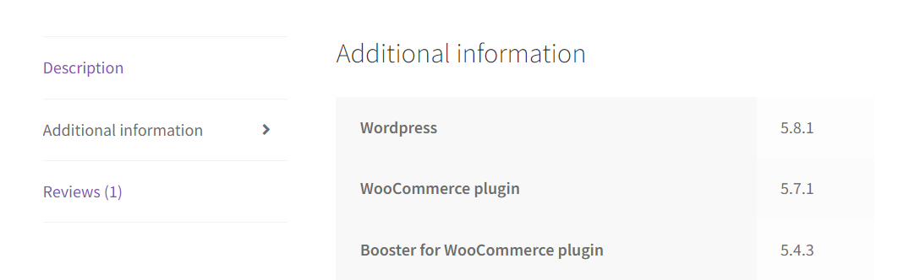
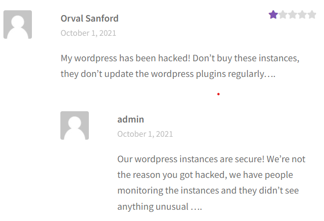
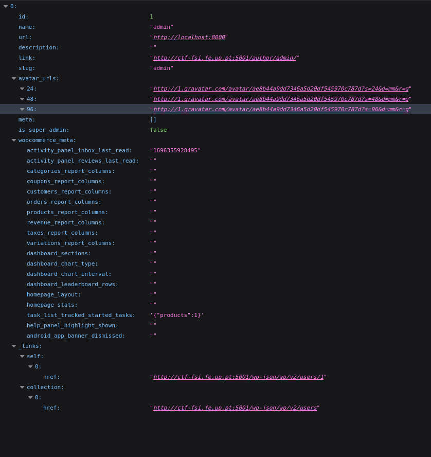
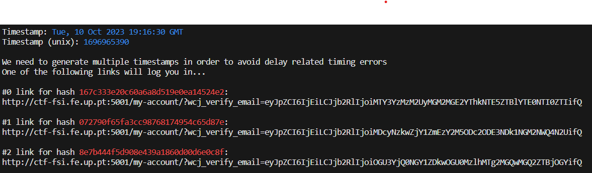
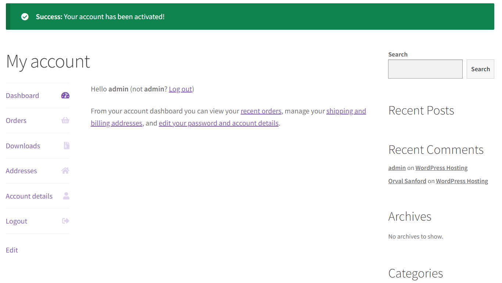
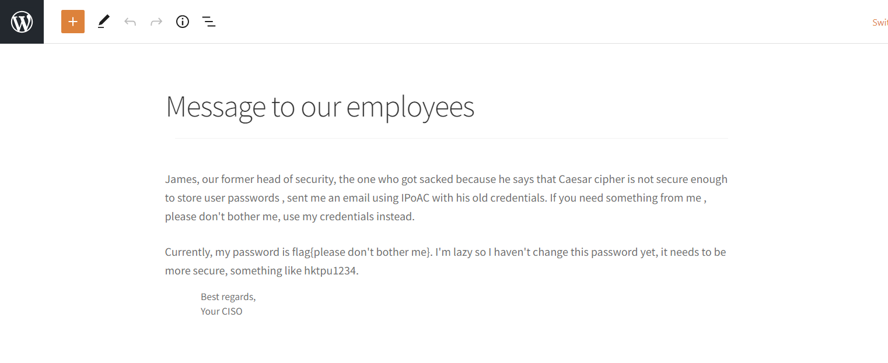

# Trabalho realizado nas Semanas #2 e #3

## Identificação

- Vulnerabilidade **CVE-2021-34646** é uma falha no plugin Booster for WooCommerce WordPress, que afeta versões anteriores e incluindo 5.4.3
- A vulnerabilidade CVE-2021-34646 é uma vulnerabilidade crítica que pode ser usada para obter acesso administrativo a sites WordPress.
- A vulnerabilidade permite que invasores deem bypass à autenticação e obtenham consequentemente acesso administrativo a um site WordPress.
- 

## Catalogação

- A vulnerabilidade foi relatada pela primeira vez em 30 de julho de 2021 pela empresa de cibersegurança Wordfence.
- A vulnerabilidade foi corrigida na versão 5.4.4 do plugin, lançada em 17 de agosto de 2021.
-
-

## Exploit

- Os exploits para CVE-2021-34646 foram desenvolvidos e estão disponíveis publicamente.
- A vulnerabilidade pode ser explorada enviando um e-mail para um usuário do site que tenha o plugin instalado.
-
-

## Explicação do ataque

- It takes the base URL of the target WordPress site and a user ID as command-line arguments.

- It sends an HTTP GET request to the target site with the specified user ID to verify the status code. If the status code is not 200, it exits.

- It extracts the "Date" header from the HTTP response to calculate a timestamp.

- It then generates multiple timestamps to avoid timing errors and computes an MD5 hash from each timestamp.

- For each generated hash, it creates a token consisting of the user ID and the hash, encodes it in base64, and removes trailing "=" characters.

- It constructs links to the "my-account" page of the WordPress site with the generated tokens and prints these links.

# CTF

## Flag 1

- Reconhecimento:
Primeiramente acedemos ao site do WordPress e procurámos pela versão do site e outras versões de plugins que a aplicação utiliza.

Descobrimos também a existencia de pelo menos dois utilizadores.

Como o próprio servidor do site é WordPress, conseguimos através de http://ctf-fsi.fe.up.pt:5001/wp-json/wp/v2/users 
descobrir que o utilizador admin tem id 1.

Depois deste reconhecimento, procurámos em bases de dados de CVE’s sobre cve relacionados com as versoes que encontrámos anteriormente, depois de alguma pesquisa, encontrámos o CVE-2021-34646.
Assim conseguimos capturar a flag 1.

## Flag 2

Agora conhecendo um CVE possivel, procuramos em sites sobre exploits relacionados, encontrando um site com um possivel exploit https://www.exploit-db.com/exploits/50299

Assim corremos o script de python: CVE-exploit.py websiteURL accountID

python3 CVE-exploit.py http://ctf-fsi.fe.up.pt:5001/ 1

com id 1 porque é o id do admin, o que gerou alguns links da página do admin já autenticada.

utilizando um dos links

Assim indo a http://ctf-fsi.fe.up.pt:5001/wp-admin/edit.php, onde está o post privado encontrámos a flag2.

