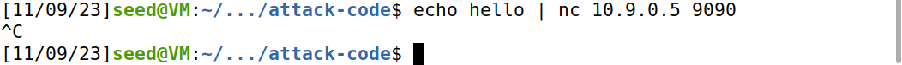
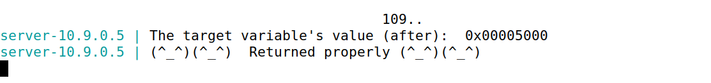

# Trabalho realizado nas Semanas #7

## Task 1

steps:
- initialize the server with the string format vulnerability
- send "hello" message to server and see the output

Terminal 1 | Terminal 2
:---------:|:---------:
 | 


- explore diferent messages to the server that could crash it, we found that a string of "%s" does it.

Terminal 1 | Terminal 2
:---------:|:---------:
 | 

## Task 2

## 2.A: Stack Data

- To print the stack data, we need to echo to the server the parser %8x, doing so, we can find out the memory address of the stack values. To help us identifie where the buffer starts we choosed 4 random bytes of data easily recognized by us to, we chose aaaa (ASCII value 61616161).


Terminal 1 | Terminal 2
:---------:|:---------:
 | 


- After some trial and error, and analysing the position of aaaa (ASCII value 61616161) on the stack we concluded that to get the first four bytes of our input, we needed to read 64 %8x.

## 2.B: Heap Data

- To print the secret message (a string) stored in the heap area, we passed the memory address of the secret message (in little endian) to the stack (using ```$( printf "\x08\x40\x0b\x08")```). After echoing %8x 63 times, (buffer size-1)-times, followed by an %s, we can read the string in the memory address of the secret message.


Terminal 1 | Terminal 2
:---------:|:---------:
 | 


## Task 3

## 3.A: Change the value to a different value.

- Change the target variable's value. To do so we followed the same logic from task 2.B, but instead of %s at the end, we used %n, this is because using %n, the number of printed characters is passed to the value of the memory address of the target variable,
```$( printf "\x08\x40\x0b\x08")``` (this is the address in little endian).


Terminal 1 | Terminal 2
:---------:|:---------:
 | 

- This way we changed the value to ```0x0000023c``` meaning that we printed 572 characters.

## 3.B: Change the value to 0x5000.

- To change the value to ```0x00005000``` we just need to print 20480 characters instead of 572. Doing a quick math, 20480-572 = 19908, we need to print 19908 more characters than before. We can do this by modifying the last ```%8x.``` to ```%19916x.```.


Terminal 1 | Terminal 2
:---------:|:---------:
 | 


