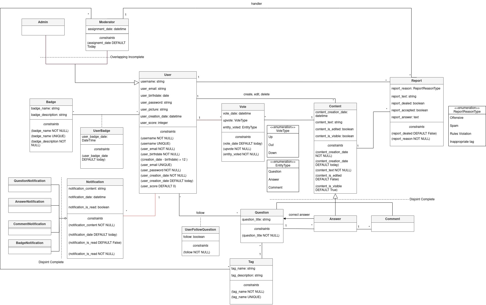

# EBD: Database Specification Component

> QueryStack is a platform for technology enthusiasts, professionals, and learners to share their knowledge and solve their problems. QueryStack allows users to ask, answer, vote, comment, and edit questions and answers related to various topics in technology, such as programming languages, frameworks, tools, algorithms, data structures, design patterns, etc. QueryStack also provides features such as tags, badges, reputation points, and leaderboards to categorize, reward, and rank the users and their contributions.

## A4: Conceptual Data Model

> This artifact's main goal is to create a more solid and prepared database schema for our website. By starting to analyze the database workload, we can make better and more useful triggers, transactions and indexes that we will need to have a good performance in our database.

### 1\. Class diagram

> UML class diagram containing the classes, associations, multiplicity and constraints.



**Figure 1:** UML


### 2\. Additional Business Rules

> Business rules can be included in the UML diagram as UML notes or in a table in this section.

| Identifier | Name | Description |
|------------|------|-------------|
| BR01 | Questions allowed | The platform only allows questions about technology |
| BR02 | User delete | When a user is deleted all his personal content is deleted from the database. |
| BR03 | History dates | The history of an user should start after his sign up in the platform. No data can be linked to a user prior his sign up. |
| BR04 | User badges | User badges are dependent on the likes and dislikes received on his questions and answers, and also on actions made by the user. |
| BR05 | Answer Date | The date of an answer to a question has to be bigger that the date of that question. |
| BR06 | Comment Date | The date of a comment to an answer has to be bigger that the date of that answer. |

***


## A5: Relational Schema, validation and schema refinement

> For this artefact, we converted our UML class diagram to a Relational Schema, following all the rules to do that.

### 1\. Relational Schema

> Here is our relation schema with all the relations we could find from the UML class diagram.

| Relational reference | Relational Compact Notation|
|---|---|
|R01| user (<u>user_id</u>, username **UK NN**, user_email **UK** **NN**, user_password **NN**, picture, user_birthdate **CK ((user_creation_date - user_birthdate) >12)**, user_creation_date **NN DEFAULT Today**, user_score **DEFAULT 0**) |
|R02|admin(<u>user_id</u> ->user)|
|R03|moderator(<u>user_id</u> ->user, tag_id-> tag **NN**, assignment **NN** **DEFAULT Today**)|
|R04|badge (<u>badge_id</u>, badge_name **NN UK**, badge_description **NN**)|
|R05|user_badge(<u>user_id</u> ->user, <u>badge_id</u> ->badge, user_badge_date **DEFAULT Today**)|
|R06|notification (<u>notification_id</u>, notification_user -> user, notification_content **NN**, notification_date **DEFAULT Today**, notification_is_read **NN DEFAULT False**, notification_type **IN NotificationType** **NN**)|
|R07|question(<u>question_id</u>, content_creation_date **NN DEFAULT Today**, content_text **NN**,content_is_edited **DEFAULT False**, content_is_visible **DEFAULT True**, question_title **NN**, question_tag ->tag, correct_answer->answer, content_author -> user)|
|R08|answer(<u>answer_id</u>, content_creation_date **NN DEFAULT Today**, content_text **NN**,content_is_edited **DEFAULT False**, content_is_visible **DEFAULT True**, question_id ->question, content_author -> user)|
|R09|comment(<u>comment_id</u>, content_creation_date **NN DEFAULT Today**, content_text **NN**,content_is_edited **DEFAULT False**, content_is_visible **DEFAULT True**, answer_id ->answer, content_author -> user)|
|R10|tag(<u>tag_id</u>, tag_name **UK NN**, tag_description)|
|R11|vote (<u>vote_id</u>, vote_author -> user, vote_date **DEFAULT Today**, upvote **NN IN VoteType**, entity_voted **NN IN EntityType**, vote_content_question -> question, vote_content_answer ->answer, vote_content_comment -> comment)|
|R12|report(<u>report_id</u>, report_creator -> user, report_handler -> moderator, report_reason **NN IN ReportReasonType**, report_text, report_dealed **DEFAULT False**, report_accepted, report_answer, content_reported_question -> question, content_reported_answer ->answer, content_reported_comment -> comment)|
|R13|user_follow_question(<u>user_id</u> ->user, <u>question_id</u> ->question, follow **NN**)|

Legend:
* **UK** - UNIQUE KEY
* **NN** - NOT NULL
* **CK** - CHECK

### 2\. Domains

> This are domains used in the relational schema.

|Domain Name| Domain Specification|
|---------|----------|
|VoteType|ENUM('Up', 'Out', 'Down')|
|EntityType|ENUM('Question', 'Answer', 'Comment')|
|ReportReasonType| ENUM ('Offensive', 'Spam', 'Rules Violation', 'Inappropriate tag') |
|Today| DATE DEFAULT CURRENT_DATE|
|NotificationType| ENUM('Question', 'Answer', 'Comment', 'Badge')|

### 3\. Schema validation

> For each table of the relational schema we all functional dependencies are identified and the normalization of all relation schemas is acomplished. Below we present the functional dependencies, keys and normal form for each table.

| **Table** **R01**| User|
| -------------------------------- | ------------------------------------------------------------ |
| **Keys**| {user_id}, {username}, {user_email}|
| **Functional** **Dependencies:** ||
| FD0101| {user_id} -> {username, user_email, user_password, picture, user_birthdate, user_creation_date,user_score} |
| FD0102| {username} -> {user_id, user_email, user_password, picture, user_birthdate, user_creation_date,user_score} |
| FD0103| {user_email} -> {user_id,username, user_password, picture, user_birthdate, user_creation_date,user_score} |
| **NORMAL FORM**| BCNF                                                         |

| **Table** **R02**| Admin |
| -------------------------------- | --------- |
| **Keys**| {user_id} |
| **Functional** **Dependencies:** |           |
| FD0201| none |
| **NORMAL FORM**| BCNF |

| **Table R03**                | Moderator                         |
| ---------------------------- | --------------------------------- |
| **Keys**                     | {user_id, tag_id}                 |
| **Functional Dependencies:** |                                   |
| FD0301                       | {user_id, tag_id} -> {assignment} |
| **NORMAL FORM**              | BCNF                              |

| **Table** **R04**            | Badge                                         |
| ---------------------------- | --------------------------------------------- |
| **Keys**                     | {badge_id}, {badge_name}                      |
| **Functional Dependencies:** |                                               |
| FD0401                       | {badge_id} -> {badge_name, badge_description} |
| FD0402                       | {badge_name} -> {badge_id, badge_description} |
| **NORMAL FORM**              | BCNF                                          |

| **Table** **R05**                | userBadge                           |
| -------------------------------- | ----------------------------------- |
| **Keys**                         | {user_id}, {badge_id}               |
| **Functional** **dependencies:** |                                     |
| FD0501                           | {user_id, badge_id} -> {badge_date} |
| **NORMAL FORM**                  | BCNF                                |

| **Table R06**                    | Notification |
| -------------------------------- | ---- |
| **Keys**                         | {notification_id} |
| **Functional dependencies:** |      |
| FD0601                           | {notification_id} -> {notification_user, notification_content, notification_date, notification_is_read, notification_type} |
| **NORMAL FORM**                  | BCNF |

| **Table R07**                    | Question                                                     |
| -------------------------------- | ------------------------------------------------------------ |
| **Keys**                         | {question_id}                                                |
| **Functional** **dependencies:** |                                                              |
| FD0701                           | {question_id} -> {content_creation_date, content_text,content_is_edited, content_is_visible, question_title, question_tag, correct_answer, content_author} |
| **NORMAL FORM**                  | BCNF                                                         |

| **Table R08**                    | Answer                                                       |
| -------------------------------- | ------------------------------------------------------------ |
| **Keys**                         | {answer_id}                                                  |
| **Functional** **dependencies:** |                                                              |
| FD0801                           | {answer_id} -> {content_author, content_creation_date, content_text, content_is_edited, content_is_visible, question_id} |
| **NORMAL FORM**                  | BCNF                                                         |

| **Table R09**                    | Comment                                                      |
| -------------------------------- | ------------------------------------------------------------ |
| **Keys**                         | {comment_id}                                                 |
| **Functional** **dependencies:** |                                                              |
| FD0901                           | {comment_id} -> {content_author, content_creation_date, content_text, content_is_edited, content_is_visible, answer_id} |
| **NORMAL FORM**                  | BCNF                                                         |

| **Table R10**                    | Tag                                     |
| -------------------------------- | --------------------------------------- |
| **Keys**                         | {tag_id}                                |
| **Functional** **dependencies:** |                                         |
| FD1001                           | {tag_id} -> {tag_name, tag_description} |
| **NORMAL FORM**                  | BCNF                                    |

| **Table R11**                    | Vote                                                         |
| -------------------------------- | ------------------------------------------------------------ |
| **Keys**                         | {vote_id}                                                    |
| **Functional** **dependencies:** |                                                              |
| FD1101                           | {vote_id} -> {vote_author, vote_date, upvote, entity_voted, vote_content_question, vote_content_answer, vote_content_comment} |
| **NORMAL FORM**                  | BCNF                                                         |

| **Table R12**                    | Report                                                       |
| -------------------------------- | ------------------------------------------------------------ |
| **Keys**                         | {report_id}                                                  |
| **Functional** **dependencies:** |                                                              |
| FD1201                           | {report_id} -> {report_creator, report_handler, report_reason, report_text,  report_dealed, report_accepted, report_answer,  content_reported_question, content_reported_answer,  content_reported_comment} |
| **NORMAL FORM**                  | BCNF                                                         |

| **Table R13**                    | userFollowsQuestion                |
| -------------------------------- | ---------------------------------- |
| **Keys**                         | {user_id, question_id}             |
| **Functional** **dependencies:** |                                    |
| FD1301                           | {user_id, question_id} -> {follow} |
| **NORMAL FORM**                  | BCNF                               |

> For each functional dependency, the group of attributes of the left side are keys, therefore, all tables are in the BCNF Form.

---


## A6: Indexes, triggers, transactions and database population

> This artefact main goal is to create a more solid and prepared database schema for our website. By starting to analyse the database workload, we can makebetter and more useful triggers, transactions and indexes that we will need to have a good performance in our database.

### 1\. Database Workload

> This is a study of the possibility of the growth of each element of our website, being just an estimation based in our criteria.

| **Relation reference** | **Relation Name** | **Order of magnitude** | **Estimated growth** |
|------------------------|-------------------|------------------------|----------------------|
| R01 | user | 1k (thousands) | 10 (tens) / day |
| R02 | admin | 10 (tens) | 1 / year |
| R03 | moderator | 10 | 1 / month |
| R04 | badge | 10 | No growth |
| R05 | user_badge | 1k | 10 / day |
| R06 | notification | 10k (tens of thousands) | 100 (hundreds) / day |
| R07 | question | 1k | 100 / day |
| R08 | answer | 1k | 100 / day |
| R09 | comment | 1k | 100 / day |
| R10 | tag | 10 | No growth |
| R11 | vote | 10k | 100 / day |
| R12 | report | 100 | 10 / day |
| R13 | user_follow_question | 100 | 10 / week |


### 2\. Proposed Indices

#### 2.1. Performance Indices

> Based on our workload, we created performance indices to improve the performance of the identified queries.

| **Index** | IDX01 |
|-----------|-------|
| **Relation** | R07 |
| **Attribute** | content_author |
| **Type** | hash |
| **Cardinality** | medium |
| **Clustering** | No |
| **Justification** | This index is essential for improving the performance of linking  questions to their respective authors, an operation that occurs  frequently. Utilizing a hash index ensures fast retrieval of  author-related information. Since this is a lookup operation without a  need for clustering, a *hash* index is the most appropriate. |
| SQL code | `CREATE INDEX idx_author_question ON question USING hash (content_author);` |

| **Index** | IDX02 |
|-----------|-------|
| **Relation** | R08 |
| **Attribute** | question_id |
| **Type** | btree |
| **Cardinality** | medium |
| **Clustering** | No |
| **Justification** | This index enhances the performance of linking answers to their  corresponding questions, a critical feature of our system. This  operation occurs frequently, and we require answers ordered results by date.  Using a *btree* index is appropriate as it provides the necessary ordering functionality. |
| SQL code | `CREATE INDEX idx_answer_question ON answer USING btree (question_id);` |

| **Index** | IDX03 |
|-----------|-------|
| **Relation** | R08 |
| **Attribute** | content_creation_date |
| **Type** | btree |
| **Cardinality** | medium |
| **Clustering** | No |
| **Justification** | This index is crucial for efficiently organizing questions by date. As  date-based sorting is a common requirement, a *btree* index is chosen  because it maintains data in a sorted order, allowing for efficient  date-based queries. |
| SQL code | `CREATE INDEX idx_question_date ON question USING btree (content_creation_date);` |

#### 2.2. Full-text Search Indices

> This assures that our website has a feature of full-text searches to the users, so they can search an item by its name, for example.

| **Index** | IDX01 |
|-----------|-------|
| **Relation** | question |
| **Attribute** | question_title, content_text |
| **Type** | GIN |
| **Clustering** | No |
| **Justification** | Provide full-text search capabilities to find questions based on titles or text, with the title having the most importance in the search result. The index type is GIN because the indexed fields are not expected to change frequently. |

**SQL code:**

```sql
-- Full-text Search Index

ALTER TABLE question
ADD COLUMN tsvectors TSVECTOR;

CREATE FUNCTION question_search_update() RETURNS TRIGGER AS $$
BEGIN
 IF TG_OP = 'INSERT' THEN
        NEW.tsvectors = (
         setweight(to_tsvector('english', NEW.question_title), 'A') ||
         setweight(to_tsvector('english', NEW.content_text), 'B')
        );
 END IF;

 IF TG_OP = 'UPDATE' THEN
         IF (NEW.question_title <> OLD.question_title OR NEW.content_text <> OLD.content_text) THEN
           NEW.tsvectors = (
             setweight(to_tsvector('english', NEW.question_title), 'A') ||
             setweight(to_tsvector('english', NEW.content_text), 'B')
           );
         END IF;
    END IF;
RETURN NEW;
END $$
LANGUAGE plpgsql;

-- Trigger before insert or update on question table.
CREATE TRIGGER question_search_update
 BEFORE INSERT OR UPDATE ON question
 FOR EACH ROW
 EXECUTE PROCEDURE question_search_update();

-- GIN index for ts_vectors.
CREATE INDEX search_idx ON question USING GIN (tsvectors);  
```

### 3\. Triggers

> Our triggers present functionalities that our database needs to have correctly work in some user stories and business rules that we already defined.

| **Trigger** | TRIGGER01 |
|-------------|-----------|
| **Description** | Making data anonymous upon a user account deletion (BR12). |

**SQL code:**

```sql
CREATE FUNCTION anonymize_content()
RETURNS TRIGGER AS $$
BEGIN
  UPDATE question
  SET content_author = -1
  WHERE content_author = OLD.user_id;
  
  UPDATE answer
  SET content_author = -1
  WHERE content_author = OLD.user_id;
  
  UPDATE comment
  SET content_author = -1
  WHERE content_author = OLD.user_id;
  
  UPDATE vote
  SET vote_author = -1
  WHERE vote_author = OLD.user_id;
  
  UPDATE report
  SET report_creator = -1
  WHERE report_creator = OLD.user_id;
  
  DELETE FROM userfollowquestion
  WHERE user_id = OLD.user_id;

  RETURN OLD;
END;
$$ LANGUAGE plpgsql;

CREATE TRIGGER member_deletion_trigger
BEFORE DELETE ON member
FOR EACH ROW
EXECUTE FUNCTION anonymize_content(); 
```

| **Trigger** | TRIGGER02 |
|-------------|-----------|
| **Description** | An user cannot answer his own question (BR05). |

**SQL code:**

```sql
CREATE FUNCTION member_answer_own_question() RETURNS TRIGGER AS $$
BEGIN
  IF NEW.content_author = (SELECT question.content_author FROM question WHERE question.content_id= NEW.question_id) THEN
      RAISE EXCEPTION 'A member cant answer his own question';
  END IF;
  RETURN NEW;
END
$$ LANGUAGE 'plpgsql';

CREATE TRIGGER member_answer_own_question
    BEFORE INSERT OR UPDATE OF content_author, question_id ON answer
    FOR EACH ROW
      EXECUTE PROCEDURE member_answer_own_question()
```

| **Trigger** | TRIGGER03 |
|-------------|-----------|
| **Description** | An user receives a notification when someone answers his question (US206). |

**SQL code:**

```sql
CREATE FUNCTION notification_answers() RETURNS TRIGGER AS $$
BEGIN
  IF NEW.question_id = (SELECT question.question_id from question where question.question_id = NEW.question_id) THEN
    INSERT INTO notification (notification_user, notification_content,notification_type) 
    VALUES ((SELECT question.content_author FROM question WHERE question.question_id = NEW.question_id), ((SELECT username from answer INNER JOIN member ON content_author = member.user_id where answer.answer_id = NEW.answer_id) || ' answered your question ' || (SELECT question_title FROM question WHERE question.question_id = NEW.question_id)), 'answer');
  END IF;
  RETURN NEW;
END;
$$ LANGUAGE 'plpgsql';

CREATE TRIGGER notification_answers
AFTER INSERT ON answer
FOR EACH ROW
  EXECUTE PROCEDURE notification_answers();
```


| **Trigger** | TRIGGER04 |
|-------------|-----------|
| **Description** | An user receives a notification when someone comments his answer (US206). |

**SQL code:**

```sql
CREATE FUNCTION notification_comments() RETURNS TRIGGER AS $$
BEGIN
  IF NEW.answer_id = (SELECT answer.answer_id from answer where answer.answer_id = NEW.answer_id) THEN
    INSERT INTO notification (notification_user, notification_content,notification_type) 
    VALUES ((SELECT answer.content_author FROM answer WHERE answer.answer_id = NEW.answer_id), ((SELECT username from comment INNER JOIN member ON content_author = member.user_id where comment.comment_id = NEW.comment_id) || ' commented your answer to question ' || (SELECT question_title FROM answer INNER JOIN comment ON answer.answer_id=comment.answer_id INNER JOIN question ON answer.question_id = question.question_id WHERE comment.comment_id = NEW.comment_id)), 'comment');
  END IF;
  RETURN NEW;
END;
$$ LANGUAGE 'plpgsql';

CREATE TRIGGER notification_comments
AFTER INSERT ON comment
FOR EACH ROW
  EXECUTE PROCEDURE notification_comments();
```


| **Trigger** | TRIGGER05 |
|-------------|-----------|
| **Description** | An user receives a notification when he wins a badge. |

**SQL code:**

```sql
CREATE FUNCTION notification_badges() RETURNS TRIGGER AS $$
BEGIN
    INSERT INTO notification (notification_user, notification_content,notification_type) 
    VALUES (NEW.user_id, 'You just won the badge ' || (SELECT badge_name FROM badge WHERE badge.badge_id = NEW.badge_id), 'badge');
  RETURN NEW;
END;
$$ LANGUAGE 'plpgsql';

CREATE TRIGGER notification_badges
AFTER INSERT ON userbadge
FOR EACH ROW
  EXECUTE PROCEDURE notification_badges();
```


| **Trigger** | TRIGGER06 |
|-------------|-----------|
| **Description** | An user gets one more point for every new comment, answer, question or vote. |

**SQL code:**


```sql
CREATE FUNCTION award_user_point()
RETURNS TRIGGER AS $$
BEGIN
    UPDATE member
    SET user_score = user_score + 1
    WHERE user_id = NEW.content_author;

    RETURN NEW;
END;
$$ LANGUAGE plpgsql;
```


```sql
CREATE TRIGGER award_user_point_question
AFTER INSERT ON question
FOR EACH ROW
EXECUTE FUNCTION award_user_point();

CREATE TRIGGER award_user_point_answer
AFTER INSERT ON answer
FOR EACH ROW
EXECUTE FUNCTION award_user_point();

CREATE TRIGGER award_user_point_comment
AFTER INSERT ON comment
FOR EACH ROW
EXECUTE FUNCTION award_user_point();
```

```sql
CREATE FUNCTION award_user_point_vote()
RETURNS TRIGGER AS $$
BEGIN
    UPDATE member
    SET user_score = user_score + 1
    WHERE user_id = NEW.vote_author;

    RETURN NEW;
END;
$$ LANGUAGE plpgsql;

CREATE TRIGGER award_user_point_vote
AFTER INSERT ON vote
FOR EACH ROW
EXECUTE FUNCTION award_user_point_vote();
```

| **Trigger** | TRIGGER07 |
|-------------|-----------|
| **Description** | An user gets a badge when he registers a new account in the system. |

**SQL code:**

```sql
CREATE FUNCTION register_badge() RETURNS TRIGGER AS $$
BEGIN
    INSERT INTO userbadge (user_id, badge_id)
  VALUES (NEW.user_id, 11);
  RETURN NEW;
END
$$ LANGUAGE 'plpgsql';

CREATE TRIGGER register_badge
  AFTER INSERT ON member
  FOR EACH ROW
    EXECUTE PROCEDURE register_badge();
```

| **Trigger** | TRIGGER08 |
|-------------|-----------|
| **Description** | An user gets a badge when he obtains 10 points by interacting with the platform. |

**SQL code:**

```sql
CREATE FUNCTION bronze_badge() RETURNS TRIGGER AS $$
BEGIN
    IF NEW.user_score = 10 THEN
      INSERT INTO userbadge (user_id, badge_id) VALUES
      (NEW.user_id, 1);
    END IF;
    RETURN NEW;
END;
$$ LANGUAGE 'plpgsql';

CREATE TRIGGER bronze_badge
AFTER INSERT OR UPDATE OF user_score ON member
FOR EACH ROW
  EXECUTE PROCEDURE bronze_badge();
```

| **Trigger** | TRIGGER09 |
|-------------|-----------|
| **Description** | An user gets a badge when he obtains 100 points by interacting with the platform. |

**SQL code:**

```sql
CREATE FUNCTION silver_badge() RETURNS TRIGGER AS $$
BEGIN
    IF NEW.user_score = 100 THEN
      INSERT INTO userbadge (user_id, badge_id) VALUES
      (NEW.user_id, 2);
    END IF;
    RETURN NEW;
END;
$$ LANGUAGE 'plpgsql';

CREATE TRIGGER silver_badge
AFTER INSERT OR UPDATE OF user_score ON member
FOR EACH ROW
  EXECUTE PROCEDURE silver_badge();
```


| **Trigger** | TRIGGER10 |
|-------------|-----------|
| **Description** | An user gets a badge when he obtains 1000 points by interacting with the platform. |

**SQL code:**

```sql
CREATE FUNCTION gold_badge() RETURNS TRIGGER AS $$
BEGIN
    IF NEW.user_score = 1000 THEN
      INSERT INTO userbadge (user_id, badge_id) VALUES
      (NEW.user_id, 3);
    END IF;
    RETURN NEW;
END;
$$ LANGUAGE 'plpgsql';

CREATE TRIGGER gold_badge
AFTER INSERT OR UPDATE OF user_score ON member
FOR EACH ROW
  EXECUTE PROCEDURE gold_badge();
```


### 4\. Transactions

> Transactions needed to assure the integrity of the data.

| SQL Reference | **User Registration Transaction** |
|---------------|------------------|
| Description | This transaction is used when a new user is registered |
| Justification | During user  registration, to prevent issues like duplicate usernames or other conflicts that might arise when multiple users register simultaneously we need to ensure that no other transaction can simultaneously modify the same data. If a problem occurs the entire transaction should be rolled back to ensure that no incomplete or incorrect data is left in the database. |
| Isolation level | SERIALIZABLE READ WRITE |

**Complete SQL Code:**

```sql
BEGIN TRANSACTION;
SET TRANSACTION ISOLATION LEVEL SERIALIZABLE READ WRITE;
SELECT * FROM member WHERE username = $username OR user_email = $user_email FOR UPDATE;
DO $$
BEGIN
    INSERT INTO member (username, user_email, user_password, picture, user_birthdate, user_creation_date, user_score)
    VALUES ($username, $user_email, $user_password, $picture, $birthdate, CURRENT_DATE, 0);
EXCEPTION
    WHEN unique_violation THEN
        RAISE NOTICE 'Username or email already exists';
END $$;
END TRANSACTION;
```

| SQL Reference   | **Answer Posting Transaction**                               |
| --------------- | ------------------------------------------------------------ |
| Description     | This transaction is used when a user posts an answer to a question |
| Justification   | This transaction involves reading data from the "question" table to  check the question's status and then inserting a new answer. To maintain data consistency, it's crucial to ensure that the question's status  doesn't change between the read and the insertion. If a concurrent  transaction updates the question status, it could lead to  inconsistencies in the database, such as a user posting an answer to a  question that should no longer be open. |
| Isolation level | REPEATABLE READ                                              |

**Complete SQL Code:**

```sql
BEGIN TRANSACTION;
SET TRANSACTION ISOLATION LEVEL REPEATABLE READ;
DO $$
BEGIN
    -- Check if the question is still visible
    -- If false, handle it
    IF (SELECT content_is_visible FROM question WHERE question_id = $question_id) = FALSE THEN
        RAISE EXCEPTION 'The question is no longer visible.';
    ELSE
        -- If the question is still visible, proceed to insert the answer
        INSERT INTO answer (question_id, content_text, content_author)
        VALUES ($question_id, $answer_text, $content_author);
    END IF;
END $$;
END TRANSACTION;
```

| SQL Reference   | **Comment Posting Transaction**                              |
| --------------- | ------------------------------------------------------------ |
| Description     | This transaction is used when a user posts a comment to a answer |
| Justification   | Reporting is essential for data integrity and community guidelines. It's crucial to ensure that the report is recorded accurately and  completely, preventing any accidental omissions. Using SERIALIZABLE  isolation level guarantees that no concurrent transactions interfere  with the reporting process, maintaining the consistency of the reported  content. |
| Isolation level | REPEATABLE READ                                              |

**Complete SQL Code:**

```sql
BEGIN TRANSACTION;
SET TRANSACTION ISOLATION LEVEL REPEATABLE READ;
DO $$
BEGIN
    -- Check if the answer is still visible
    -- If false, handle it
    IF (SELECT content_is_visible FROM answer WHERE answer_id = $answer_id) = FALSE THEN
        RAISE EXCEPTION 'The answer is no longer visible.';
    ELSE
        -- If the question is still visible, proceed to insert the answer
        INSERT INTO comment (answer_id, content_text, content_author)
        VALUES ($answer_id, $comment_text, $content_author);
    END IF;
END $$;
END TRANSACTION;
```

| SQL Reference   | Transaction for Reporting                                    |
| --------------- | ------------------------------------------------------------ |
| Description     | This transaction is used to handle the reporting of content (questions, answers, comments) by users |
| Justification   | Reporting is essential for data integrity and community guidelines. It's crucial to ensure that the report is recorded accurately and  completely, preventing any accidental omissions. Using SERIALIZABLE  isolation level guarantees that no concurrent transactions interfere with the reporting process, maintaining the consistency of the reported  content. |
| Isolation level | REPEATABLE READ                                              |

**Complete SQL Code:**

```sql
BEGIN TRANSACTION;
SET TRANSACTION ISOLATION LEVEL REPEATABLE READ;
DO $$
BEGIN
	-- Check if the reported content is still visible and hasn't been deleted
	IF EXISTS (SELECT 1 FROM question WHERE question_id = $question_id AND content_is_visible = true) OR
       EXISTS (SELECT 1 FROM answer WHERE answer_id = $answer_id AND content_is_visible = true) OR
       EXISTS (SELECT 1 FROM comment WHERE comment_id = $comment_id AND content_is_visible = true) THEN
       -- Content is still visible, proceed with the report
       INSERT INTO report (report_creator, content_reported_question, content_reported_answer, content_reported_comment, report_reason, report_text)
       VALUES ($report_creator, $question_id, $answer_id, $comment_id, $report_reason, $report_text);
    ELSE
       -- Content is not visible, handle accordingly
       RAISE EXCEPTION 'The reported content is no longer found.';
    END IF;
END $$;
END TRANSACTION;
```

| SQL Reference   | Transaction for Handling Votes                               |
| --------------- | ------------------------------------------------------------ |
| Description     | This transaction involves inserting a new vote record, reflecting a user's vote on content, such as upvotes or downvotes |
| Justification   | Handling votes is critical for maintaining the integrity of user interactions with content. Ensuring the accurate recording of votes prevents discrepancies in the voting system. Using SERIALIZABLE isolation level guarantees that concurrent transactions do not interfere with the vote handling process. |
| Isolation level | REPEATABLE READ                                              |

**Complete SQL Code:**

```sql
BEGIN TRANSACTION;
SET TRANSACTION ISOLATION LEVEL REPEATABLE READ;
DO $$
BEGIN

INSERT INTO vote (vote_author, upvote, entity_voted, vote_content_question, vote_content_answer, vote_content_comment)
    VALUES ($vote_author, 'up', $entity_voted, $vote_content_question, $vote_content_answer, $vote_content_comment);

-- Update the user score based on the new vote
-- It is done by the trigger

END $$;
END TRANSACTION;
```


## Annex A. SQL Code

> The database scripts are included in this annex to the EBD component.
>
> The database creation script and the population script should be presented as separate elements. The creation script includes the code necessary to build (and rebuild) the database. The population script includes an amount of tuples suitable for testing and with plausible values for the fields of the database.
>
> The complete code of each script must be included in the group's git repository and links added here.

### A.1. Database schema

```sql
------------------------------------------------------------------------------------------------------------------------
------------------------------------------------------------------------------------------------------------------------
-- SCHEMA FOR LBAW2311
-- Updated: 21.10.2023 - 23:20
------------------------------------------------------------------------------------------------------------------------
------------------------------------------------------------------------------------------------------------------------

--DROP SCHEMA IF EXISTS lbaw2311 CASCADE;
--CREATE SCHEMA IF NOT EXISTS lbaw2311;
--SET search_path TO lbaw2311;
--SHOW search_path;

------------------------------------------------------------------------------------------------------------------------
-- DROP ALL FROM LBAW2311 SCHEMA
------------------------------------------------------------------------------------------------------------------------
-- DROP TABLES FROM LBAW2311 SCHEMA
DROP TABLE IF EXISTS admin;
DROP TABLE IF EXISTS moderator CASCADE;
DROP TABLE IF EXISTS userbadge;
DROP TABLE IF EXISTS questionnotification;
DROP TABLE IF EXISTS answernotification;
DROP TABLE IF EXISTS commentnotification;
DROP TABLE IF EXISTS badgenotification;
DROP TABLE IF EXISTS notification;
DROP TABLE IF EXISTS answer CASCADE;
DROP TABLE IF EXISTS question CASCADE;
DROP TABLE IF EXISTS comment CASCADE;
DROP TABLE IF EXISTS content CASCADE;
DROP TABLE IF EXISTS member CASCADE;
DROP TABLE IF EXISTS badge;
DROP TABLE IF EXISTS tag;
DROP TABLE IF EXISTS vote;
DROP TABLE IF EXISTS report;
DROP TABLE IF EXISTS userfollowquestion;
-- DROP TYPES FROM LBAW2311 SCHEMA
DROP TYPE IF EXISTS voteType;
DROP TYPE IF EXISTS entityType;
DROP TYPE IF EXISTS reportReasonType;
DROP TYPE IF EXISTS notificationType;


-- Drop triggers
DROP TRIGGER IF EXISTS award_user_point_vote ON vote;
DROP TRIGGER IF EXISTS award_user_point_question ON question;
DROP TRIGGER IF EXISTS award_user_point_answer ON answer;
DROP TRIGGER IF EXISTS award_user_point_comment ON comment;
DROP TRIGGER IF EXISTS member_deletion_trigger ON member;
DROP TRIGGER IF EXISTS question_search_update on question;
DROP TRIGGER IF EXISTS notification_answers on answer;
DROP TRIGGER IF EXISTS notification_comment on comment;
DROP TRIGGER IF EXISTS notification_badges on userbadge;
DROP TRIGGER IF EXISTS member_answer_own_question ON answer;
DROP TRIGGER IF EXISTS register_badge ON member;
DROP TRIGGER IF EXISTS bronze_badge ON member;
DROP TRIGGER IF EXISTS silver_badge ON member;
DROP TRIGGER IF EXISTS gold_badge ON member;
DROP FUNCTION IF EXISTS member_answer_own_question();
DROP FUNCTION IF EXISTS notification_comments();
DROP FUNCTION IF EXISTS notification_badges();
DROP FUNCTION IF EXISTS notification_answers();
DROP FUNCTION IF EXISTS member_answer_own_question();
DROP FUNCTION IF EXISTS award_user_point_vote();
DROP FUNCTION IF EXISTS award_user_point();
DROP FUNCTION IF EXISTS anonymize_content();
DROP FUNCTION IF EXISTS question_search_update();
DROP FUNCTION IF EXISTS register_badge();
DROP FUNCTION IF EXISTS bronze_badge();
DROP FUNCTION IF EXISTS silver_badge();
DROP FUNCTION IF EXISTS gold_badge();


------------------------------------------------------------------------------------------------------------------------
-- CREATE TYPES/DOMAINS FOR LBAW2311 SCHEMA
------------------------------------------------------------------------------------------------------------------------
CREATE TYPE voteType AS ENUM ('up', 'down', 'out');
CREATE TYPE entityType AS ENUM ('question', 'answer', 'comment');
CREATE TYPE reportReasonType AS ENUM ('spam', 'offensive', 'Rules Violation', 'Inappropriate tag');
CREATE TYPE notificationType AS ENUM ('question', 'answer', 'comment', 'badge');

------------------------------------------------------------------------------------------------------------------------
-- CREATE TABLES FOR LBAW2311 SCHEMA
------------------------------------------------------------------------------------------------------------------------
-- Create the User table (R01)
CREATE TABLE member (
    user_id SERIAL PRIMARY KEY,
    username VARCHAR(25) UNIQUE NOT NULL,
    user_email VARCHAR(25) UNIQUE NOT NULL,
    user_password VARCHAR(255) NOT NULL,
    picture VARCHAR(255),
    user_birthdate TIMESTAMP NOT NULL,
    user_creation_date TIMESTAMP NOT NULL DEFAULT CURRENT_TIMESTAMP,
    user_score INT DEFAULT 0,
	CONSTRAINT check_time CHECK (EXTRACT(YEAR FROM user_creation_date) - EXTRACT(YEAR FROM user_birthdate) > 12 )
);

-- Create the Tag table (R10)
CREATE TABLE tag (
    tag_id SERIAL PRIMARY KEY,
    tag_name VARCHAR(255) UNIQUE NOT NULL,
    tag_description VARCHAR(255)
);

-- Create the Admin table (R02)
CREATE TABLE admin (
    user_id INT PRIMARY KEY,
    FOREIGN KEY (user_id) REFERENCES member(user_id)
);

-- Create the Moderator table (R03)
CREATE TABLE moderator (
    user_id INT PRIMARY KEY,
    tag_id INT NOT NULL,
    assignment TIMESTAMP NOT NULL DEFAULT CURRENT_TIMESTAMP,
    FOREIGN KEY (user_id) REFERENCES member(user_id),
    FOREIGN KEY (tag_id) REFERENCES tag(tag_id)
);

-- Create the Badge table (R04)
CREATE TABLE badge (
    badge_id SERIAL PRIMARY KEY,
    badge_name VARCHAR(25) UNIQUE NOT NULL,
    badge_description VARCHAR(255) NOT NULL
);

-- Create the UserBadge table (R05)
CREATE TABLE userbadge (
    userbadge_id SERIAL PRIMARY KEY,
    user_id INT,
    badge_id INT,
    user_badge_date TIMESTAMP NOT NULL DEFAULT CURRENT_TIMESTAMP,
    FOREIGN KEY (user_id) REFERENCES member(user_id),
    FOREIGN KEY (badge_id) REFERENCES badge(badge_id)
);

-- Create the Notification table (R06)
CREATE TABLE notification (
    notification_id SERIAL PRIMARY KEY,
    notification_user INT,
    notification_content VARCHAR(255) NOT NULL,
    notification_date TIMESTAMP NOT NULL DEFAULT CURRENT_TIMESTAMP,
    notification_is_read BOOLEAN NOT NULL DEFAULT FALSE,
    notification_type notificationType NOT NULL,
    FOREIGN KEY (notification_user) REFERENCES member(user_id)
);

-- Create the Answer table (R08)
CREATE TABLE answer (
    answer_id SERIAL PRIMARY KEY,
    question_id INT,
    --Common to content
    content_author INT,
    content_creation_date TIMESTAMP NOT NULL DEFAULT CURRENT_TIMESTAMP,
    content_text VARCHAR(255) NOT NULL,
    content_is_edited BOOLEAN NOT NULL DEFAULT FALSE,
    content_is_visible BOOLEAN NOT NULL DEFAULT TRUE,
    FOREIGN KEY (content_author) REFERENCES member(user_id)
);

-- Create the Question table (R07)
CREATE TABLE question (
    question_id SERIAL PRIMARY KEY,
    question_title VARCHAR(255) NOT NULL,
    question_tag INT,
    correct_answer INT,
    --Common to content
    content_author INT,
    content_creation_date TIMESTAMP NOT NULL DEFAULT CURRENT_TIMESTAMP,
    content_text VARCHAR(255) NOT NULL,
    content_is_edited BOOLEAN NOT NULL DEFAULT FALSE,
    content_is_visible BOOLEAN NOT NULL DEFAULT TRUE,
    FOREIGN KEY (content_author) REFERENCES member(user_id)
);

-- Create a foreign key for question_tag in the question table
ALTER TABLE question
    ADD CONSTRAINT FK_Tag_Question
        FOREIGN KEY (question_tag) REFERENCES tag(tag_id);

-- Create a foreign key for correct_answer in the question table
ALTER TABLE question
    ADD CONSTRAINT FK_Correct_Answer
        FOREIGN KEY (correct_answer) REFERENCES answer(answer_id);

--
ALTER TABLE answer
    ADD CONSTRAINT fk_question
        FOREIGN KEY (question_id) REFERENCES question(question_id);

ALTER TABLE userbadge DROP CONSTRAINT userbadge_user_id_fkey;

ALTER TABLE userbadge
ADD CONSTRAINT userbadge_user_id_fkey
FOREIGN KEY (user_id)
REFERENCES member(user_id)
ON DELETE CASCADE;

ALTER TABLE notification
DROP CONSTRAINT notification_notification_user_fkey;

ALTER TABLE notification
ADD CONSTRAINT notification_notification_user_fkey
FOREIGN KEY (notification_user)
REFERENCES member(user_id)
ON DELETE CASCADE; 


-- Create the Comment table (R09)
CREATE TABLE comment (
    comment_id SERIAL PRIMARY KEY,
    answer_id INT,
    --Common to content
    content_author INT,
    content_creation_date TIMESTAMP NOT NULL DEFAULT CURRENT_TIMESTAMP,
    content_text VARCHAR(255) NOT NULL,
    content_is_edited BOOLEAN NOT NULL DEFAULT FALSE,
    content_is_visible BOOLEAN NOT NULL DEFAULT TRUE,
    FOREIGN KEY (content_author) REFERENCES member(user_id),
    FOREIGN KEY (answer_id) REFERENCES answer(answer_id)
);

-- Create the Vote table (R11)
CREATE TABLE vote (
    vote_id SERIAL PRIMARY KEY,
    vote_author INT,
    vote_date TIMESTAMP NOT NULL DEFAULT CURRENT_TIMESTAMP,
    upvote voteType NOT NULL,
    entity_voted entityType NOT NULL,
    vote_content_question INT,
    vote_content_answer INT,
    vote_content_comment INT,
    FOREIGN KEY (vote_author) REFERENCES member(user_id),
    FOREIGN KEY (vote_content_question) REFERENCES question(question_id),
    FOREIGN KEY (vote_content_answer) REFERENCES answer(answer_id),
    FOREIGN KEY (vote_content_comment) REFERENCES comment(comment_id)
);

-- Create the Report table (R12)
CREATE TABLE report (
    report_id SERIAL PRIMARY KEY,
    report_creator INT,
    report_handler INT,
    content_reported_question INT,
    content_reported_answer INT,
    content_reported_comment INT,
    report_reason reportReasonType NOT NULL,
    report_text VARCHAR(255),
    report_dealt BOOLEAN NOT NULL DEFAULT FALSE,
    report_accepted BOOLEAN,
    report_answer VARCHAR(255),
    FOREIGN KEY (report_creator) REFERENCES member(user_id),
    FOREIGN KEY (report_handler) REFERENCES moderator(user_id),
    FOREIGN KEY (content_reported_question) REFERENCES question(question_id),
    FOREIGN KEY (content_reported_answer) REFERENCES answer(answer_id),
    FOREIGN KEY (content_reported_comment) REFERENCES comment(comment_id)
);

-- Create the UserFollowQuestion table (R13)
CREATE TABLE userfollowquestion (
    user_id INT,
    question_id INT,
    follow BOOLEAN NOT NULL,
    FOREIGN KEY (user_id) REFERENCES member(user_id),
    FOREIGN KEY (question_id) REFERENCES question(question_id)
);

------------------------------------------------------------------------------------------------------------------------
------------------------------------------------------------------------------------------------------------------------
-- INDEXES
------------------------------------------------------------------------------------------------------------------------
------------------------------------------------------------------------------------------------------------------------
-- Performance indexes
CREATE INDEX idx_author_question ON question USING hash (content_author);
CREATE INDEX idx_answer_question ON answer USING hash (question_id);
CREATE INDEX idx_question_date ON question USING btree (content_creation_date);

-- Full-text Search Index
-- Create a ts_vector column for the question table
ALTER TABLE question
ADD COLUMN tsvectors TSVECTOR;
-- Create a function to update the ts_vector column
-- This function is called by the trigger below
CREATE FUNCTION question_search_update() RETURNS TRIGGER AS $$
BEGIN
-- Update the ts_vector column only if the question is inserted
 IF TG_OP = 'INSERT' THEN
        NEW.tsvectors = (
         setweight(to_tsvector('english', NEW.question_title), 'A') ||
         setweight(to_tsvector('english', NEW.content_text), 'B')
        );
 END IF;
-- Update the ts_vector column only if the question title or content text is changed
 IF TG_OP = 'UPDATE' THEN
         IF (NEW.question_title <> OLD.question_title OR NEW.content_text <> OLD.content_text) THEN
           NEW.tsvectors = (
             setweight(to_tsvector('english', NEW.question_title), 'A') ||
             setweight(to_tsvector('english', NEW.content_text), 'B')
           );
         END IF;
    END IF;
RETURN NEW;
END $$
LANGUAGE plpgsql;

-- Trigger before insert or update on question table.
-- This trigger calls the function above to update the ts_vector column
CREATE TRIGGER question_search_update
 BEFORE INSERT OR UPDATE ON question
 FOR EACH ROW
 EXECUTE PROCEDURE question_search_update();

-- GIN index for ts_vectors.
-- This index is used to perform full-text search on the ts_vector column
CREATE INDEX search_idx ON question USING GIN (tsvectors);


------------------------------------------------------------------------------------------------------------------------
------------------------------------------------------------------------------------------------------------------------
-- TRIGGERS AND FUNCTIONS
------------------------------------------------------------------------------------------------------------------------
------------------------------------------------------------------------------------------------------------------------

-- TRIGGER 01 - Making data anonymous upon a user account deletion (BR12)

-- Delete user, his content appears as deleted user
CREATE FUNCTION anonymize_content()
RETURNS TRIGGER AS $$
BEGIN
    -- Update content authored by the deleted member to "anonymous"
    UPDATE question
    SET content_author = -1
    WHERE content_author = OLD.user_id;

    UPDATE answer
    SET content_author = -1
    WHERE content_author = OLD.user_id;
    
    UPDATE comment
    SET content_author = -1
    WHERE content_author = OLD.user_id;
    
    -- Update vote records by the deleted member to "anonymous"
    UPDATE vote
    SET vote_author = -1
    WHERE vote_author = OLD.user_id;
    
    -- Update report records by the deleted member to "anonymous"
    UPDATE report
    SET report_creator = -1
    WHERE report_creator = OLD.user_id;
    
    -- Update userfollowquestion records by the deleted member to "anonymous"
    DELETE FROM userfollowquestion
    WHERE user_id = OLD.user_id;

    RETURN OLD;
END;
$$ LANGUAGE plpgsql;

-- Create the trigger for the member delete
CREATE TRIGGER member_deletion_trigger
BEFORE DELETE ON member
FOR EACH ROW
EXECUTE FUNCTION anonymize_content();

-- TRIGGER 02 - An user cannot answer his own question (BR05)

CREATE FUNCTION member_answer_own_question() RETURNS TRIGGER AS $$
BEGIN
  IF NEW.content_author = (SELECT question.content_author FROM question WHERE question.question_id= NEW.question_id) THEN
      RAISE EXCEPTION 'A member cant answer his own question';
  END IF;
  RETURN NEW;
END
$$ LANGUAGE 'plpgsql';

CREATE TRIGGER member_answer_own_question
    BEFORE INSERT OR UPDATE OF content_author, question_id ON answer
    FOR EACH ROW
      EXECUTE PROCEDURE member_answer_own_question();


-- TRIGGER 03 - An user receives a notification when someone answers his question.

CREATE FUNCTION notification_answers() RETURNS TRIGGER AS $$
BEGIN
  IF NEW.question_id = (SELECT question.question_id from question where question.question_id = NEW.question_id) THEN
    INSERT INTO notification (notification_user, notification_content,notification_type)
    VALUES ((SELECT question.content_author FROM question WHERE question.question_id = NEW.question_id), ((SELECT username from answer INNER JOIN member ON content_author = member.user_id where answer.answer_id = NEW.answer_id) || ' answered your question ' || (SELECT question_title FROM question WHERE question.question_id = NEW.question_id)), 'answer');
  END IF;
  RETURN NEW;
END;
$$ LANGUAGE 'plpgsql';

CREATE TRIGGER notification_answers
AFTER INSERT ON answer
FOR EACH ROW
  EXECUTE PROCEDURE notification_answers();


-- TRIGGER 04 - An user receives a notification when someone comments his answer.

CREATE FUNCTION notification_comments() RETURNS TRIGGER AS $$
BEGIN
  IF NEW.answer_id = (SELECT answer.answer_id from answer where answer.answer_id = NEW.answer_id) THEN
    INSERT INTO notification (notification_user, notification_content,notification_type)
    VALUES ((SELECT answer.content_author FROM answer WHERE answer.answer_id = NEW.answer_id), ((SELECT username from comment INNER JOIN member ON content_author = member.user_id where comment.comment_id = NEW.comment_id) || ' commented your answer to question ' || (SELECT question_title FROM answer INNER JOIN comment ON answer.answer_id=comment.answer_id INNER JOIN question ON answer.question_id = question.question_id WHERE comment.comment_id = NEW.comment_id)), 'comment');
  END IF;
  RETURN NEW;
END;
$$ LANGUAGE 'plpgsql';

CREATE TRIGGER notification_comments
AFTER INSERT ON comment
FOR EACH ROW
  EXECUTE PROCEDURE notification_comments();


-- TRIGGER 05 - An user receives a notification when he wins a new badge.

CREATE FUNCTION notification_badges() RETURNS TRIGGER AS $$
BEGIN
    INSERT INTO notification (notification_user, notification_content,notification_type)
    VALUES (NEW.user_id, 'You just won the badge ' || (SELECT badge_name FROM badge WHERE badge.badge_id = NEW.badge_id), 'badge');
  RETURN NEW;
END;
$$ LANGUAGE 'plpgsql';

CREATE TRIGGER notification_badges
AFTER INSERT ON userbadge
FOR EACH ROW
  EXECUTE PROCEDURE notification_badges();


-- TRIGGER 06 - An user gets one more point for every new comment, answer, question or vote.

CREATE FUNCTION award_user_point()
RETURNS TRIGGER AS $$
BEGIN
    -- Increment user's score by one for any action (question, answer, comment)
    UPDATE member
    SET user_score = user_score + 1
    WHERE user_id = NEW.content_author;

    RETURN NEW;
END;
$$ LANGUAGE plpgsql;

-- Create the trigger for different tables (question, answer, comment)
CREATE TRIGGER award_user_point_question
AFTER INSERT ON question
FOR EACH ROW
EXECUTE FUNCTION award_user_point();

CREATE TRIGGER award_user_point_answer
AFTER INSERT ON answer
FOR EACH ROW
EXECUTE FUNCTION award_user_point();

CREATE TRIGGER award_user_point_comment
AFTER INSERT ON comment
FOR EACH ROW
EXECUTE FUNCTION award_user_point();

-- Create a trigger to award users one point for each vote
CREATE FUNCTION award_user_point_vote()
RETURNS TRIGGER AS $$
BEGIN
    UPDATE member
    SET user_score = user_score + 1
    WHERE user_id = NEW.vote_author;

    RETURN NEW;
END;
$$ LANGUAGE plpgsql;

CREATE TRIGGER award_user_point_vote
AFTER INSERT ON vote
FOR EACH ROW
EXECUTE FUNCTION award_user_point_vote();


-- TRIGGER 07 - An user gets a badge when he registers a new account in the system.

CREATE FUNCTION register_badge() RETURNS TRIGGER AS $$
BEGIN
     INSERT INTO userbadge (user_id, badge_id)
     VALUES (NEW.user_id, 11);
  RETURN NEW;
END
$$ LANGUAGE 'plpgsql';

CREATE TRIGGER register_badge
  AFTER INSERT ON member
  FOR EACH ROW
    EXECUTE PROCEDURE register_badge();

-- TRIGGER 08 - An user gets a badge when he obtains 10 points by interacting with the platform.

CREATE FUNCTION bronze_badge() RETURNS TRIGGER AS $$
BEGIN
    IF NEW.user_score = 10 THEN
      INSERT INTO userbadge (user_id, badge_id) VALUES
      (NEW.user_id, 1);
    END IF;
    RETURN NEW;
END;
$$ LANGUAGE 'plpgsql';

CREATE TRIGGER bronze_badge
AFTER INSERT OR UPDATE OF user_score ON member
FOR EACH ROW
    EXECUTE PROCEDURE bronze_badge();

-- TRIGGER 09 - An user gets a badge when he obtains 100 points by interacting with the platform.
CREATE FUNCTION silver_badge() RETURNS TRIGGER AS $$
BEGIN
    IF NEW.user_score = 100 THEN
      INSERT INTO userbadge (user_id, badge_id) VALUES
      (NEW.user_id, 2);
    END IF;
    RETURN NEW;
END;
$$ LANGUAGE 'plpgsql';

CREATE TRIGGER silver_badge
AFTER INSERT OR UPDATE OF user_score ON member
FOR EACH ROW
  EXECUTE PROCEDURE silver_badge();


-- TRIGGER 10 - An user gets a badge when he obtains 1000 points by interacting with the platform.

CREATE FUNCTION gold_badge() RETURNS TRIGGER AS $$
BEGIN
    IF NEW.user_score = 1000 THEN
      INSERT INTO userbadge (user_id, badge_id) VALUES
      (NEW.user_id, 3);
    END IF;
    RETURN NEW;
END;
$$ LANGUAGE 'plpgsql';

CREATE TRIGGER gold_badge
AFTER INSERT OR UPDATE OF user_score ON member
FOR EACH ROW
  EXECUTE PROCEDURE gold_badge();

```

### A.2. Database population

```sql
------------------------------------------------------------------------------------------------------------------------
------------------------------------------------------------------------------------------------------------------------
-- CREATE POPULATE FOR LBAW2311 SCHEMA
-- Updated: 21.10.2023 - 23:20
------------------------------------------------------------------------------------------------------------------------
------------------------------------------------------------------------------------------------------------------------

------------------------------------------------------------------------------------------------------------------------
-- POPULATE TABLES FOR LBAW2311 SCHEMA
------------------------------------------------------------------------------------------------------------------------
-- Populate the Badge table (R04)
INSERT INTO badge (badge_name, badge_description)
VALUES ('Bronze', 'Bronze-level badge'), -- Assigned when you gained 10 points
       ('Silver', 'Silver-level badge'), -- Assigned when you gained 100 points
       ('Gold', 'Gold-level badge'), -- Assigned when you gained 1000 points
       ('Reliable', 'One of your answers was accepted as the correct answer'), -- Assigned when you have an answer accepted as the correct answer
       ('Notable Question', 'Your question was upvoted 100 times'), -- Assigned when you have a question with 100 upvotes
       ('Good Question', 'Your question was upvoted 25 times'), -- Assigned when you have a question with 25 upvotes
       ('Nice Question', 'Your question was upvoted 10 times'), -- Assigned when you have a question with 10 upvotes
       ('Notable Answer', 'Your answer was upvoted 100 times'), -- Assigned when you have an answer with 100 upvotes
       ('Good Answer', 'Your answer was upvoted 25 times'), -- Assigned when you have an answer with 25 upvotes
       ('Nice Answer', 'Your answer was upvoted 10 times'), -- Assigned when you have an answer with 10 upvotes
       ('Welcome', 'You have joined the community'); -- Assigned when you create your account

-- Populate the User table (R01)
--  The user_creation_date is automatically generated by the database

INSERT INTO member (user_id, username, user_email, user_password, picture, user_birthdate, user_score)
VALUES (-1, 'deleted', 'deleted@example.com', 'pass', '/picture/avatar1.jpg', '1990-01-15', 0 );

INSERT INTO member (username, user_email, user_password, picture, user_birthdate, user_score)
VALUES ('admin', 'admin@example.com', 'pass', '/picture/avatar1.jpg', '1990-01-15', 0 ),
       ('moderator', 'moderator@example.com', 'pass', '/picture/avatar2.jpg', '1990-01-15',  0 ),
       ('member1', 'member1@example.com', 'pass','/picture/avatar3.jpg', '1990-01-21', 0 );


-- Populate the Tag table (R15)
INSERT INTO tag (tag_name, tag_description)
VALUES ('programming', 'Programming-related questions'),
       ('database', 'Database management topics'),
       ('web', 'Web development questions'),
       ('networking', 'Networking-related questions'),
       ('security', 'Security-related questions'),
       ('hardware', 'Hardware-related questions'),
       ('software', 'Software-related questions'),
       ('mobile', 'Mobile development questions'),
       ('game', 'Game development questions'),
       ('other', 'Other questions');

-- Populate the Admin table (R02)
INSERT INTO admin (user_id)
VALUES (1);

-- Populate the Moderator table (R03)
-- The assignment timestamp is automatically generated by the database
INSERT INTO moderator (user_id, tag_id)
VALUES (2, 1);


-- Populate the UserBadge table (R05)
-- The user_badge_date is automatically generated by the database
INSERT INTO userbadge (user_id, badge_id)
VALUES (1, 1),  -- Welcome badge for admin
       (2, 1),  -- Welcome badge for moderator
       (3, 1),  -- Welcome badge for member1
       (1, 4);   -- Reliable badge for admin


-- NOTIFICATION IS INITIALLY EMPTY AS THESE ARE THE DEFAULTS FOR TEST PURPOSES
-- AFTER THE FEATURES ARE IMPLEMENTED IN THE WEBSITE, THE NOTIFICATIONS WILL BE
-- CREATED BY THE TRIGGERS AND POPULATED ON ITS OWN

-- Populate the Question table (R12)
-- The content_creation_date is automatically generated by the database
-- The content_is_edited is automatically set to false by the database
-- The content_is_visible is automatically set to true by the database
INSERT INTO question (question_title, question_tag, correct_answer, content_author, content_text)
VALUES ('How to program in Python?', 1, NULL, 3, 'I want to learn Python programming. Any advice is helpful.'),             -- Question from member1
       ('Database design tips', 2, NULL, 2, 'I need advice on using docker with a database. Any help is appreciated.');  -- Question from moderator

-- Populate the Answer table (R13)
-- The content_creation_date is automatically generated by the database
-- The content_is_edited is automatically set to false by the database
-- The content_is_visible is automatically set to true by the database
INSERT INTO answer (question_id, content_author, content_text)
VALUES (1, 1, 'Start with Python basics. Learn data types, variables, and control structures.'), -- Answer to question 'How to program in Python?' from admin
       (1, 2, 'Practice Python syntax by writing small programs. Use online resources.'),        -- Answer to question 'How to program in Python?' from moderator
       (1, 1, 'Explore Python libraries like NumPy and Pandas for data analysis.'),              -- Answer to question 'How to program in Python?' from admin
       (2, 1, 'Ensure a clear data model. Normalize tables for efficient data storage.'),        -- Answer to question 'Database design tips' from admin
       (2, 3, 'Use a database management system like MySQL or PostgreSQL.'),                     -- Answer to question 'Database design tips' from member1
       (2, 1, 'Consider indexes for faster queries. Plan for data backup and recovery.');        -- Answer to question 'Database design tips' from admin

-- Insert correct answer into question 1
UPDATE question
SET correct_answer = 3
WHERE question_id = 1;

-- Populate the Comment table (R14)
-- The content_creation_date is automatically generated by the database
-- The content_is_edited is automatically set to false by the database
-- The content_is_visible is automatically set to true by the database
INSERT INTO comment (answer_id, content_author, content_text)
VALUES (1, 3, 'Great advice! Thanks for sharing.'), -- Comment on answer 3  of question 1 from member1
       (2, 3, 'Thanks for the information. But do you have anything more specific?'), -- Comment on answer 4 of question 1 from member1
       (3, 1, 'You''re welcome! Keep coding!'), -- Comment on answer 4 of question 1 from admin
       (4, 3, 'Normalization is a key concept in DB design.'), -- Comment on answer 6 of question 2 from member1
       (5, 1, 'Consider PostgreSQL for database management. It is what I use.'), -- Comment on answer 7 of question 2 from admin
       (6, 3, 'Data backup is crucial for disaster recovery.'); -- Comment on answer 8 of question 2 from member1

-- Populate the Vote table (R16)
-- The vote_date is automatically generated by the database
INSERT INTO vote (vote_author, upvote, entity_voted, vote_content_question, vote_content_answer, vote_content_comment)
VALUES (2, 'up', 'answer',NULL ,3, NULL ), -- Upvote answer 3 (belongs to admin) of question 1 from moderator
       (1, 'up', 'answer',NULL, 6, NULL), -- Upvote answer 7 (belongs to member1) of question 2 from admin
       (1, 'down', 'question', 2, NULL, NULL), -- Downvote question 2 (belongs to moderator) from admin
       (3, 'up', 'question', 2, NULL, NULL ), -- Upvote question 2 (belongs to moderator) from member1
       (3, 'up', 'answer', NULL , 3, NULL); -- Upvote answer 3 (belongs to admin) from member1

-- Populate the Report table (R17)
-- The report_dealt is automatically set to false by the database
INSERT INTO report (report_creator, report_handler, content_reported_question, 
            content_reported_answer, content_reported_comment , report_reason, report_text)
VALUES (3, NULL, NULL, 4, NULL, 'spam', 'Inappropriate content'), -- Report on answer 4 from member1
       (1, NULL, 2, NULL, NULL, 'offensive', 'Offensive language'); -- Report on question 2 from admin

-- THESE REPORTS ARE TO BE ASSIGNED A HANDLER AND BE REFUSED
-- FOR TEST PURPOSES AFTER THE FEATURES ARE IMPLEMENTED

-- Populate the UserFollowQuestion table (R18)
INSERT INTO userfollowquestion (user_id, question_id, follow)
VALUES (1, 1, true),  -- Follow question 1 from admin. He wants to be notified of any new activity
       (2, 2, false), -- Unfollow question 2 from moderator. It's his own question but he does not want any more notifications about it
       (3, 1, true),  -- Follow question 1 from member1. A user must follow his own questions by default
       (3, 2, true);  -- Follow question 2 from member1. He wants to be notified of any new activity
```


---

## Revision history

Changes made to the first submission:

1.  None

---

GROUP 0111, 03/10/2023

* António José Salazar Correia, up201804832@up.pt
* Gonçalo Nuno Leitão Pinho da Costa, up202103336@up.pt 
* Tomás Pereira Maciel, up202006845@up.pt 
* Ricardo Miguel Matos Oliveira Peralta, up202206392@up.pt (Editor)