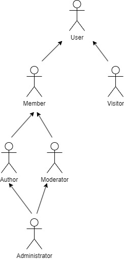
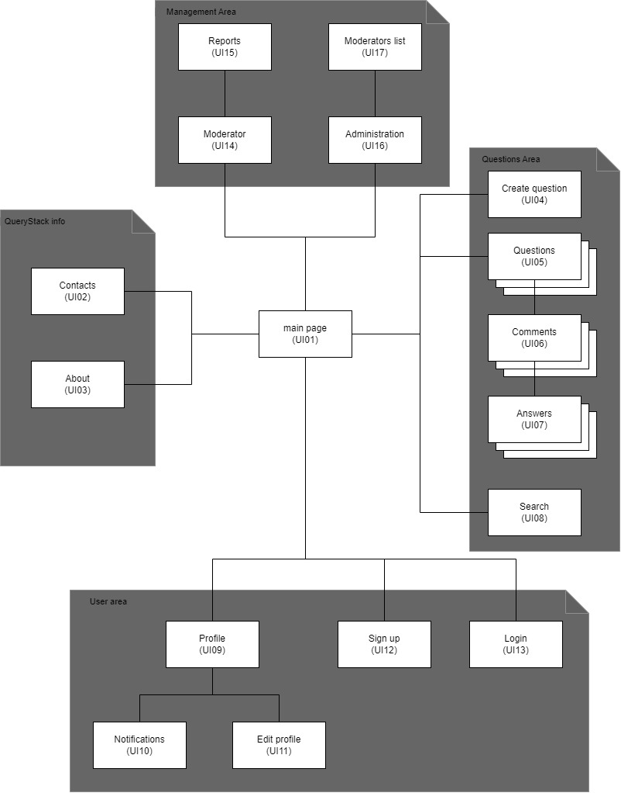
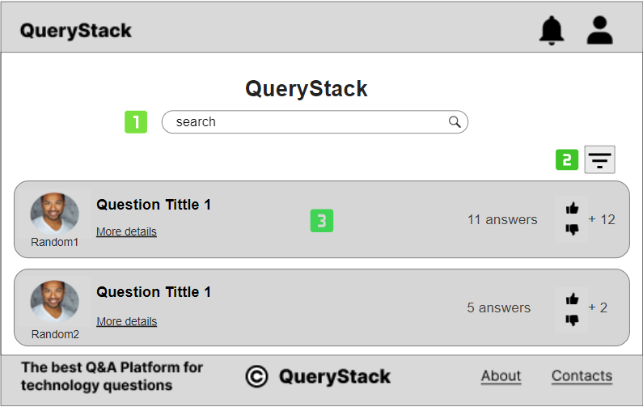
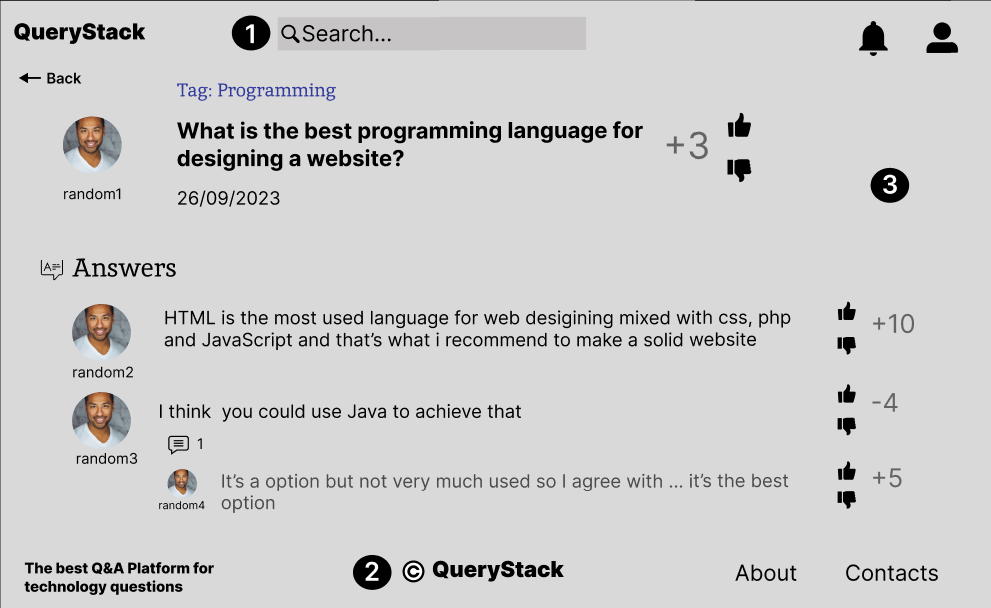
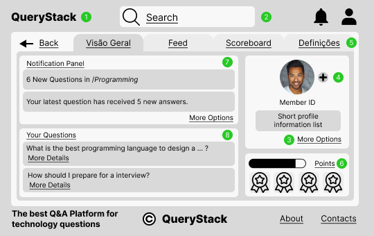

# ER: Requirements Specification Component

[[_TOC_]]

> QueryStack is a platform for technology enthusiasts, professionals, and learners to share their knowledge and solve their problems. QueryStack allows users to ask, answer, vote, comment, and edit questions and answers related to various topics in technology, such as programming languages, frameworks, tools, algorithms, data structures, design patterns, etc. QueryStack also provides features such as tags, badges, reputation points, and leaderboards to categorize, reward, and rank the users and their contributions.

## A1: QueryStack

Welcome to _QueryStack_! Our mission is to create a dynamic and inclusive online platform for technology enthusiasts to connect, share knowledge, and seek assistance with their technology-related and professional aspirations.

Our project targets all those in need of help, either with their more technical issues or just for professional guidance.

Our goal is to bring people together with speed and accuracy, so that anyone can safely get their questions answered and with insights from different realities across the world. A group of moderators, supervised by our platform's administrators, are responsible for ensuring the accuracy of the content, thus, avoiding inappropriate or offensive comments. Our administrators are responsible for the upkeep of the platform and the swift resolution of any issues encountered during navigation or users.

Any unauthenticated user has the typical permissions of a guest user which are to see, filter and search for public questions previously made. If he wants to be able to use more features, he should create an account and then sign in.

Alongside administrators and moderators, any authenticated user can reply to any authors' questions, give their opinions as comments, see all other answers given to questions and vote on whether an answer is correct or incorrect. A personalized score board allows all users to keep track of achievements in the form of badges and its overall interactions in the platform as a score .

With this project we seek to empower individuals to harness the power of technology and the spread of constructive knowledge.

## A2: Actors and User stories

> On this artifact, we will describe the actors, user stories, supplementary requirements, technical requirements and restrictions of our system.

### 1\. Actors

> For our project, the actors are represent in Figure 1 and described in table 1.

### Actors Diagram

**Figure 1:** Actors

### Actors Description

| Identifier | Description |
|------------|-------------|
| User | Generic user that has access to public information, such as questions and answers. |
| Visitor | Unauthenticated user. Can sign up or sign in. |
| Member | Authenticated user that can post and answer questions, post comments, rate answers and edit his profile. By interacting with the system, he has a score, which allows for the ranking of the members. |
| Author | Authenticated user. Can edit or remove its own content (questions, answers or comments). |
| Moderator | Authenticated user that is responsible to delete wrong or abusive content and edit questions tags. |
| Administrator | Authenticated user. Responsible for user management and is the only one able to assign moderators. |

Table 1: Actors description

### 2\. User Stories

> For the QueryStack project consider the user stories that are presented in the following section.

#### 2.1. Visitor

| identifier | Name | Priority | Description |
|------------|------|----------|-------------|
| US01 | Sign-in | High | As a Visitor, I want to log in into the system, so that I can access all the information and participate in discussions. |
| US02 | Sign-up | High | As a Visitor, I want to register into the system, so that later I can authenticate into the system. |

Table 2: Visitor's user stories

#### 2.2. User

| identifier | Name | Priority | Description |
|------------|------|----------|-------------|
| US11 | Home Page | High | As a User, I want to access the home page so that I can see the top and newest questions. |
| US12 | Search | High | As a User, I want to search information so that I can access the content I want. |
| US13 | Filter | High | As a User, I want to filter my search so that I can have a more efficient and faster search. |
| US14 | About Page | High | As a User, I want to access the about page so that I can see a detailed description of the website. |
| US15 | Contacts Page | High | As a User, I want to access the contacts page so that I can communicate with the platform creators. |
| US16 | Personal scoreboard and badges | High | As a Member, I want to view my scoreboard so that I can evaluate my usage of the platform. |
| US17 | View scoreboards and badges | High | As a Member, I want to view other members scoreboards so that I can know its interactions in the platform and the quality of its interactions. |

Table 3: User´s user stories

#### 2.3. Member

| identifier | Name | Priority | Description |
|------------|------|----------|-------------|
| US201 | Post Question | High | As a Member, I want to post a question so that people answer it and I can be clarified in some subject. |
| US202 | Post Answer | High | As a Member, I want to answer a question so that I can share my thoughts about that question. |
| US203 | Post comment | High | As a Member, I want to post a comment so that I tell my opinion. |
| US204 | Rate/Vote | High | As a Member, I want to rate content so that I help highlight better content about that topic. |
| US205 | Personal Feed | High | As a Member, I want to access my personal feed so that I can see information about the topics I am more interested about. |
| US206 | Follow | High | As a Member, I want to follow a question so that I can be notified when someone add new information to it. |
| US207 | Log out | High | As a Member, I want to log out so that I don’t keep my account open on the browser. |
| US208 | Edit profile | High | As a Member, I want to edit my profile so that I keep it updated or delete it. |
| US209 | Delete account | High | As a Member, I want to delete my account so that no personal information remains in the platform. |
| US210 | Report | Medium | As a Member, I want to report content so that it will be analyzed by the Moderator to take further decisions. |
| US211 | Add friend | Low | As a Member, I want to add a friend so that I keep updated of the questions he does. |
| US212 | Profile Page | High | As a Member, I want to access my profile page so that I can see my information and my activity in the platform. |

Table 4: Member's user stories

#### 2.4. Author

| identifier | Name | Priority | Description |
|------------|------|----------|-------------|
| US31 | Edit question | High | As an Author I want to edit a question so that I can correct it or reformulate it. |
| US32 | Delete question | High | As an Author I want to delete a question so that it won’t be visible to anybody. |
| US33 | Edit answer | High | As an Author I want to edit an answer so that I correct my own answer. |
| US34 | Delete answer | High | As an Author I want to delete an answer so that anybody can see it anymore. |
| US35 | Edit comment | High | As an author,I want to edit a comment so that it is correct. |
| US36 | Delete comment | High | As an Author I want to delete a comment so that anybody will see it anymore. |
| US37 | Close question | Medium | As an Author I want to close a question so that nobody posts more answers. |

Table 5: Author's user stories

#### 2.5. Moderator

| Identifier | Name | Priority | Description |
|------------|------|----------|-------------|
| US41 | Delete content | High | As a Moderator I want to delete content so that there is no inappropriate or offensive content. |
| US42 | Edit question tags | High | As a Moderator I want to edit questions tags so that a question has the correct tag. |
| US43 | Manage reports | High | As a Moderator I want to manage reports so that I can decide who should be banned and who shouldn’t. |
| US44 | Ban or block member | Medium | As a Moderator, I want to ban or block members so that people with incorrect behaviour get penalized in the system. |

Table 6: Moderator's user stories

### 2.6 Administrator

| Identifier | Name | Priority | Description |
|------------|------|----------|-------------|
| US51 | Manage tags | High | As an Administrator I want to manage tags so that only exists proper tags in the system. |
| US52 | Assign moderator | High | As an Administrator I want to assign a moderator so that he has Moderator powers. |
| US53 | Remove moderator | High | As an Administrator I want to remove a Moderator so that he no longer has Moderator powers. |
| US54 | Manage members | High | As an Administrator I want to ban or review a member so that he has limited capabilities in the platform. |

Table 7: Administrator's user stories

### 3\. Supplementary Requirements

> This section contains business rules, technical requirements and other non-functional requirements on the project.

#### 3.1. Business rules

> A business rule defines or constrains one aspect of the business.

| Identifier | Name | Description |
|------------|------|-------------|
| BR01 | Questions allowed | The platform only allows questions about technology |
| BR02 | Answers | All authenticated users can answer questions |
| BR03 | Up and down votes | All users can vote on an answer moving it up or down given its content and correctness |
| BR04 | Offensive or innapropriate content | No offensive or innapropriate content (offenses, threats and disrespect) are allowed in the platform |
| BR05 | Author answer | An author can't answer is own question, however he is able to comment and vote on the answers to his question |
| BR06 | User delete | When a user is deleted all his personal content is deleted from the database. |
| BR07 | Comment dates | All comments date should be after the post of the question |
| BR08 | History dates | The history of an user should start after his sign up in the platform. No data can be linked to a user prior his sign up. |
| BR09 | Administrators | Administrators are participating members of the community, so they can post, vote and answer questions. |
| BR10 | Edited content | Edited content, such as questions and answers, if edited, should have a clear identification that they were edited. |
| BR11 | User badges | User badges are dependent on the likes and dislikes received on his questions and answers, and also on actions made by the user. |
| BR12 | Account Deletion | Upon account deletion shared user data (e.g. comments, reviews, likes) is kept but is made anonymous |

Table 8: Business rules

#### 3.2. Technical requirements

> Technical requirements are concerned with the technical aspects that the system must meet. The three most critical are marked in bold.

| Identifier | Name | Description |
|------------|------|-------------|
| **TR01** | **Availability** | **The system must be available 99% of the time in each 24-hour period** |
| TR02 | Security | The system must be secure and protect user's personal info |
| **TR03** | **Usability** | **The system should be simple and easy to use** |
| TR04 | Accessibility | The system must ensure that everyone can access the pages, regardless of whether they have any handicap or not, or the Web browser or device they use. |
| TR05 | Performance | The system should have response times shorter than 2s to ensure the user's attention |
| TR06 | Scalability | The system should be prepared to deal with the growth in the number of users and corresponding operations |
| TR07 | Ethics | The system must respect the ethical principles in software development |
| **TR08** | **Robustness** | **The system must be prepared to handle and continue operating when runtime errors occur** |

Table 9:Technical requirements

#### 3.3. Restrictions

> A restriction on the design limits the degree of freedom in the search for a solution.

| Identifier | Name | Description |
|------------|------|-------------|
| C01 | Team Size | The team is of 4 elements through all project development |
| C02 | Deployment | The system should be up and running by the end of the semester |
| C03 | Deadlines | All 4 deadlines during the project should be respected |

Table 10: Restrictions

## A3: Information Architecture

> In this artifact we will demonstrate how our website will be mapped and every page that can be accessed, as well as the expected design for our pages.
>
> This artifact includes two elements:
>
> 1. A sitemap, defining how the information is organized in pages;
> 2. Two wireframes, defining the functionality and the content for each page.

### 1\. Sitemap

> A sitemap is a visual representation of the relationship between the different pages of a website that shows how all the information fits together.

The **QueryStack** webpage is organized in 4 main areas. The QueryStack information area is composed of static pages with general information, the management area contains the administration features for both moderators and administrators and the questions area pages allow a user to navigate the content of the platform. Finally, the user area pages are used to control user specific features such has their profile or authentication.

**Figure 2:** Sitemap

### 2\. Wireframes

> Wireframes are used to describe layout ideas, content, and the overall page-level design.
>
> In the next figures, it will be presented the wireframes for both Home Page and Question Page.

For the **QueryStack** platform, the wireframes for the **Home Page (UI01)**, **Question Page (UI05)**, Profile Page(UI09) are presented in Figures 3, 4 and 5, respectively.

#### UI01: Home Page

**Figure 3:** Home page (UI01) wireframe

1. Home page search bar
2. Sort button to sort the questions
3. Questions ordered by time (the last ones to be uploaded on the page)

#### UI02: Question Page

**Figure 4:** Question page (UI05) wireframe

1. Search bar (for navigation)
2. Footer
3. Main content of the page

#### UI03: Profile Page

**Figure 5:** Profile page (UI09) wireframe

1. Page ID and Home page return button
2. Search bar
3. Button that redirects to the settings tab
4. Button to change avatar
5. Detailed profile tabs other than the default
6. Scoreboard with member's points and his badges
7. Notification panel with the most recent notifications
8. Personal feed with the headers of the member's questions

## Revision history

1. A1 done and A2 started
2. A2 User stories done
3. A2 Supplementary Requirements done
4. A3 started
5. Correction of errors and adition of aspects on A2
6. Final touches on ER for delivery

---

**GROUP 0111, _01/10/2023_**

* António José Salazar Correia, up201804832@up.pt
* Gonçalo Nuno Leitão Pinho da Costa, up202103336@up.pt (Editor)
* Tomás Pereira Maciel, up202006845@up.pt 
* Ricardo Miguel Matos Oliveira Peralta, up202206392@up.pt