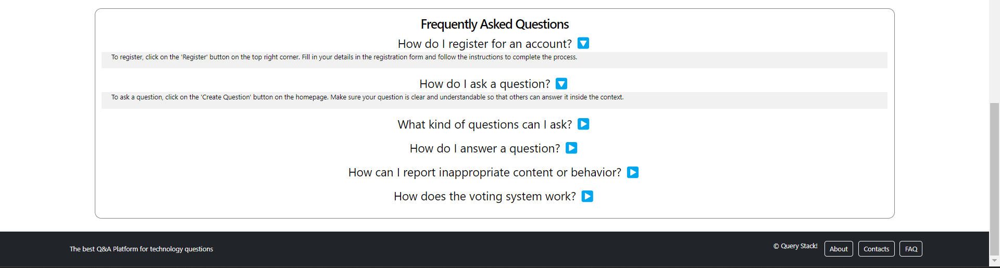
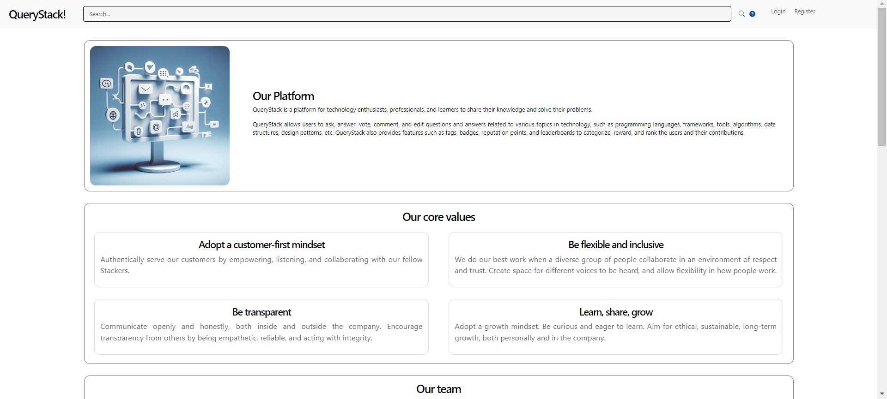
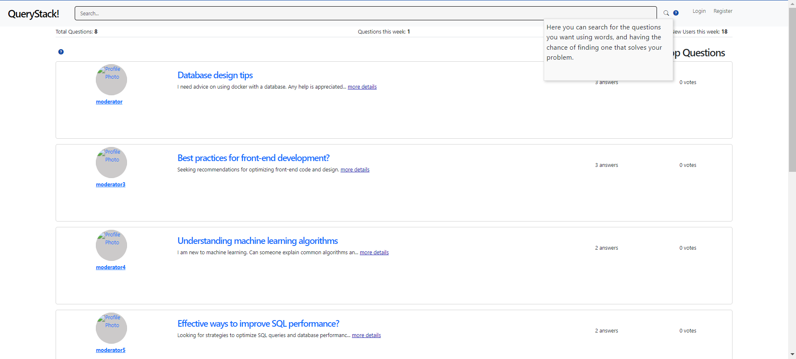
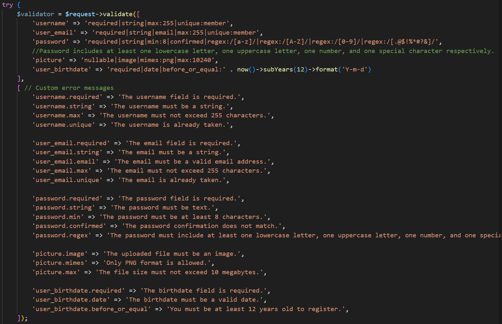
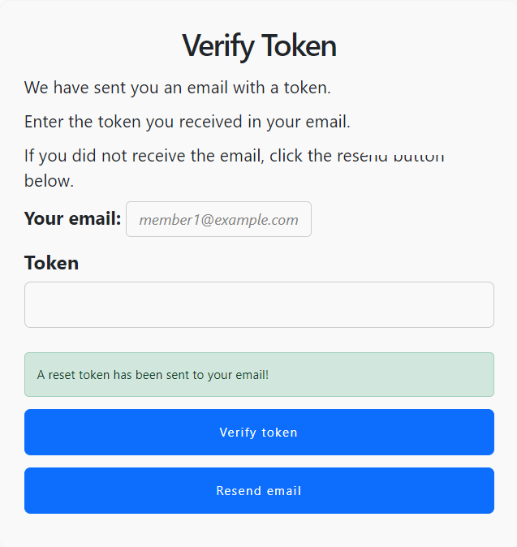
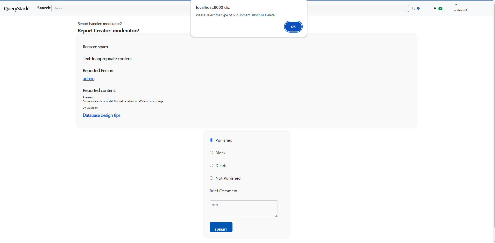
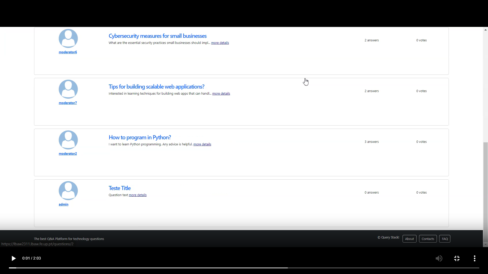

# PA: Product and Presentation

## A9: Product

> QueryStack is a platform for technology enthusiasts, professionals, and learners to share their knowledge and solve their problems. QueryStack allows users to ask, answer, vote, comment, and edit questions and answers related to various topics in technology, such as programming languages, frameworks, tools, algorithms, data structures, design patterns, etc. QueryStack also provides features such as tags, badges, reputation points, and leaderboards to categorize, reward, and rank the users and their contributions.  

### 1. Installation

 We have released the final version of the product online, so it is available on the live server.
 <br> If you want to execute the image locally just do this in the console:

```
docker run -d -p 8000:80 --name=lbaw2311 -e DB_DATABASE="lbaw2311" -e DB_SCHEMA="lbaw2311" -e DB_USERNAME="lbaw2311" -e DB_PASSWORD="cEeBNmYm" git.fe.up.pt:5050/lbaw/lbaw2324/lbaw2311
```

### 2. Usage

> URL to the product: [https://lbaw2311.lbaw.fe.up.pt](https://lbaw2311.lbaw.fe.up.pt) (FEUP's VPN needed). 


#### 2.1. Administration Credentials


| Username | Password |
| -------- | -------- |
| moderator@example.com| pass |
| admin@example.com | pass |

From moderator2 to moderator10 the password is the same and the username is just adding @example.com to the moderator and his number.

> Credentials for MailTrap and Pusher 

| Username | Password |
| -------- | -------- |
| querystack353@gmail.com | pg!password | 

Both MailTrap and Pusher are in Sandbox environment, so to test the features that require them you can use these credentials.


#### 2.2. User Credentials

| Type          | Username  | Password |
| ------------- | --------- | -------- |
| member | member1@example.com| pass |

From member1 to member6 the password is the same and the username is just adding @example.com to the moderator and his number.

### 3. Application Help

 The features related to help were implemented both on static pages (about and FAQ), but also as contextual help that the user can access when he is on the home page. The contextual help is obtained by hovering the question-mark icons distributed on the homepage. The static pages can be accessed via the buttons present on the right of the footer.


Here is the FAQ page. We can see the answer to the question by clicking on the blue arrow:



**Figure 1:** FAQ page

Also the about page that is very similar (in structure) to the faq:



**Figure 2:** About page

Hover the question marks to obtain help related to some features of the homepage:



**Figure 3:** Contextual help

This was the help we implemented, we decided to not implement more related to help since our website funcionalities are very intuitive regarding the perception of the user, so this help focus on the more usual help that websites present


### 4. Input Validation

> Describe how input data was validated, and provide examples to scenarios using both client-side and server-side validation.  



**Figure 4:** Validate on backend

On the backend we validated data using a "validate" function imported using Illuminate\Http\Request. 



**Figure 5:** Token Validation

We used a token validation when recovering a password.



**Figure 6:** Client side Validation

We validated on the client side if every mandatory parameters were filled. 


### 5. Check Accessibility and Usability


>[Usability Report](https://git.fe.up.pt/lbaw/lbaw2324/lbaw2311/-/blob/main/validator/Checklist%20de%20Usabilidade.png?ref_type=heads): 25/28

>[Accessibility Report](https://git.fe.up.pt/lbaw/lbaw2324/lbaw2311/-/blob/main/validator/Checklist%20de%20Acessibilidade.png?ref_type=heads): 14/18

### 6. HTML & CSS Validation

[Link to Validator](https://git.fe.up.pt/lbaw/lbaw2324/lbaw2311/-/tree/main/validator?ref_type=heads)

### 7. Revisions to the Project

Database 

* Creation of table 'password_reset' to store the tokens used to recover the password
* Creation of attribute 'blocked' on table Member to handle the block of an user
* Modification of Triggers 6, 8, 9, 10, 11, 12 regarding points and badges 

User Stories:   

* Creation of US212 - Profile Page
* Creation of US17 - View scoreboards and badges

### 8. Implementation Details

#### 8.1. Libraries Used

* [FontAwesome](https://fontawesome.com/), that we used for the implementation of some icons for the visual part.
* [Bootstrap](https://getbootstrap.com/), only for the css part to obtain an appealing frontend.
* [Laravel Echo](https://github.com/laravel/echo), for the implementation of websockets.
* [Pusher](https://pusher.com/), for the implementation of websockets to connect to pusher
* [MailTrap](https://mailtrap.io/), for the implementation of email sending


#### 8.2 User Stories


| US Reference | Description | Priority | Team Members | State |
|----------|----------|----------|-----|-----| 
| US01 | Sign-in | High | **Ricardo Peralta** | 100% |
| US02 | Sign-up | High | **Ricardo Peralta** | 100% |
| US11 | Home Page | High | **António Correia** | 100% |
| US12 | Search | High |**António Correia** | 75% |
| US13 | Filter | High | **Ricardo Peralta** | 75% |
| US14 | About Page | High | **Ricardo Peralta** | 100% |
| US15 | Contacts Page | High | **Ricardo Peralta** | 100% |
| US16 | Personal scoreboard and badges | High | **Tomás Maciel** Gonçalo Costa | 100% |
| US17 | View scoreboards and badges | High | **Gonçalo Costa** Tomás Maciel | 100% |
| US201 | Post Question | High | **Tomás Maciel** | 100% |
| US202 | Post Answer | High | **Tomás Maciel** | 100% |
| US203 | Post comment | High |**Tomás Maciel** |  100% |
| US204 | Rate/Vote | High | **Tomás Maciel** | 100% |
| US205 | Personal Feed | High | **Tomás Maciel** | 100% |
| US206 | Follow | High | **Tomás Maciel** | 100% |
| US207 | Log out | High | **Ricardo Peralta** | 100% |
| US208 | Edit profile | High | **Gonçalo Costa** | 90% |
| US209 | Delete account | High | **Gonçalo Costa** | 100% |
| US210 | Report | Medium | **Gonçalo Costa** | 100% |
| US211 | Add friend | Low | To be implemented | 0%|
| US212 | Profile Page | High | **Gonçalo Costa** | 100% |
| US31 | Edit question | High | **Tomás Maciel** |  100% |
| US32 | Delete question | High | **Tomás Maciel** |  100% |
| US33 | Edit answer | High | **Tomás Maciel** |  100% |
| US34 | Delete answer | High | **Tomás Maciel** |  100% |
| US35 | Edit comment | High | **Tomás Maciel** |  100% |
| US36 | Delete comment | High | **Tomás Maciel** |  100% |
| US37 | Close question | Medium | **Gonçalo Costa** | 100% |
| US41 | Delete content | High | **Gonçalo Costa** |  100% |
| US42 | Edit question tags | High | **Gonçalo Costa** | 100% |
| US43 | Manage reports | High | **Gonçalo Costa** | 100% |
| US44 | Ban or block member | Medium | **Gonçalo Costa** | 100% |
| US51 | Manage tags | High | **Gonçalo Costa** | 100% |
| US52 | Assign moderator | High | **Gonçalo Costa** | 100% |
| US53 | Remove moderator | High | **Gonçalo Costa** | 100% |
| US54 | Manage members | High | **Gonçalo Costa** | 100% |

---


## A10: Presentation

### 1. Product presentation

> QueryStack is a free and open source platform for technology technology enthusiasts to share experience and help other technology admirers. People can create questions, answer, comment and vote. The platform also provides features such as tags, badges, reputation points to categorize, reward and rank the users and their contributions.
QueryStack is made using HTML5, JavaScript, CSS3, PHP, PostgreSQL and Bootstrap. 


> URL to the product: [https://lbaw2311.lbaw.fe.up.pt](https://lbaw2311.lbaw.fe.up.pt) (FEUP's VPN needed).


### 2. Video presentation




**Figure 7:** Video Screenshot

[Video](https://git.fe.up.pt/lbaw/lbaw2324/lbaw2311/-/blob/main/validator/lbaw2311.mp4?ref_type=heads)


### Conclusion
In this and the previous delivery António did not help to develop our product. Our colleague in the previous delivery was in charge of doing the search and the home page and they were both delivered in the last day of the submission and with several bugs. This way, for this delivery he was in charge of improving it, which never really arrived, and he also said he would do the CSS part. The search was never delivered, as for the CSS he always kept on delaying his delivery and the first time he did it was with a commit straight in main branch, without creating a merge request and ignoring much of the work he had done, because he overwrote  what we did. He was warned, his commit was reversed. Later on, on the day before of the last delivery António did exactly the same, commiting straight in the main branch, overwritting many changes we did previously and with many bugs, so once again we had to revert his commit. Finally, when we realized we would have to do the CSS part, that António was responsible, we saw that he had done imports of things that were not allowed on the project, such as JQuery, and we had to correct of all this in the last day of the project. 
This being said not only António did not participate and helped developing the product, he created even more difficulties to the rest of the members of the group. 

As we only found out this imports in the last day, we tried to understand where he used it and change it. However, it might not have been possible to find all the places where he used it, so we had to leave the import, even though we corrected the usages we found. We just kept it in case it does affect some feature we did not find in this last day.

## Revision history

Changes made to the first submission:
1. None

***
GROUP2311, 21/12/2023
 
* António José Salazar Correia, up201804832@up.pt
* Gonçalo Nuno Leitão Pinho da Costa, up202103336@up.pt (Editor)
* Tomás Pereira Maciel, up202006845@up.pt 
* Ricardo Miguel Matos Oliveira Peralta, up202206392@up.pt